# OpenTruss 技术架构文档

## 1. 概述

OpenTruss 是一个面向建筑施工行业的生成式 BIM 中间件，采用 **"Graph First, Geometry Generated"**（图逻辑优先，几何由生成而来）的核心理念。

### 1.1 架构目标

- **高性能计算**：毫秒级响应前端交互（如拖拽墙体节点更新拓扑）
- **语义标准化**：确保数据符合 GB50300 国标和 IFC 标准
- **可扩展性**：支持大规模建筑项目的图数据管理
- **可维护性**：清晰的系统分层，便于开发和维护

---

## 2. 双模架构 (LPG + RDF Dual-Mode Architecture)

OpenTruss 的核心创新在于融合了两种图技术的优势：

### 2.1 Runtime Layer (LPG - 属性图)

**技术栈**：Memgraph (Cypher 查询语言)

**作用**：
- 高性能计算与状态管理
- 存储构件的几何属性、实时状态（Draft/Verified）、置信度
- 管理 2D 拓扑连接关系
- 支持复杂的图遍历查询

**典型场景**：
- 工程师在前端拖拽墙体节点时，LPG 负责毫秒级更新拓扑关系
- 规则引擎执行构件聚合查询
- 实时验证构件完整性

**数据特点**：
- 节点类型：Project, Building, Division, SubDivision, Item, InspectionLot, Element
- 关系类型：CONTAINS, HAS_LOT, LOCATED_AT, CONNECTED_TO
- 支持属性索引，优化查询性能

### 2.2 Semantic Layer (RDF - 资源描述框架)

**技术**：Ontology Mapping (本体映射)

**作用**：
- 语义标准化
- LPG 中的节点标签和关系严格映射 RDF 本体
- 确保未来可对接 Knowledge Graph
- 支持导出 IFCOWL（IFC Ontology Web Language）

**映射示例**：
```
LPG Node: :Building
RDF Mapping: bot:Building

LPG Node: :Element {speckle_type: "Wall"}
RDF Mapping: ifc:Wall

LPG Relationship: -[:CONTAINS]->
RDF Mapping: bot:containsElement
```

**优势**：
- 确保语义一致性
- 支持跨系统数据交换
- 便于知识图谱集成

---

## 3. 系统分层架构

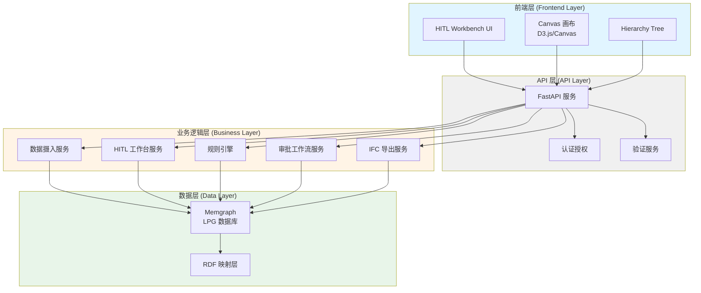

### 3.1 前端层 (Frontend Layer)

**技术栈**：
- Next.js（React 框架，支持 SSR 和客户端渲染）
- Tailwind CSS (v4)（实用优先的 CSS 框架）
- D3.js（2D 拓扑可视化和图操作）
- Canvas API（高性能图形渲染）
- TypeScript（类型安全）

**核心组件**：
- **HITL Workbench**：主工作台界面
- **Hierarchy Tree**：左侧导航树（Building → ... → Item）
- **Canvas**：中间无限画布（Trace Mode）
- **Parameter Panel**：右侧参数修正面板
- **Toolbar**：顶部悬浮工具栏

**交互模式**：
- **Trace Mode**：修复 2D 拓扑
- **Lift Mode**：批量设置 Z 轴参数
- **Classify Mode**：拖拽构件归类

### 3.2 API 层 (API Layer)

**技术栈**：FastAPI (Python)

**职责**：
- RESTful API 端点定义
- 请求/响应验证（Pydantic）
- 认证与授权（JWT/OAuth2）
- 错误处理与日志记录
- API 版本管理

**关键模块**：
- 路由管理
- 中间件（CORS、认证、限流）
- 异常处理
- 响应格式化

### 3.3 业务逻辑层 (Business Layer)

#### 3.3.1 数据摄入服务 (Ingestion Service)

**职责**：
- 接收上游 AI Agent 的识别结果
- 实现"宽进严出"策略
- 数据格式转换（Speckle Objects → LPG Nodes）
- 暂存未分配构件到 Unassigned Item

**关键逻辑**：
```python
def ingest_elements(elements: List[SpeckleObject]) -> IngestResult:
    # 宽进：允许 height, material, inspection_lot_id 为空
    # 暂存：无法确定归属的构件挂载到 Unassigned Item
    pass
```

#### 3.3.2 HITL 工作台服务 (Workbench Service)

**职责**：
- 提供构件查询接口
- 支持 Trace/Lift/Classify 操作
- 实时更新拓扑关系
- 批量操作支持

#### 3.3.3 规则引擎 (Rule Engine)

规则引擎是 OpenTruss 的核心校验组件，采用**分层防御策略**，通过前后端协同工作，确保数据质量。详细设计参见 [规则引擎架构文档](../rules/RULE_ENGINE.md)。

**架构概述**：

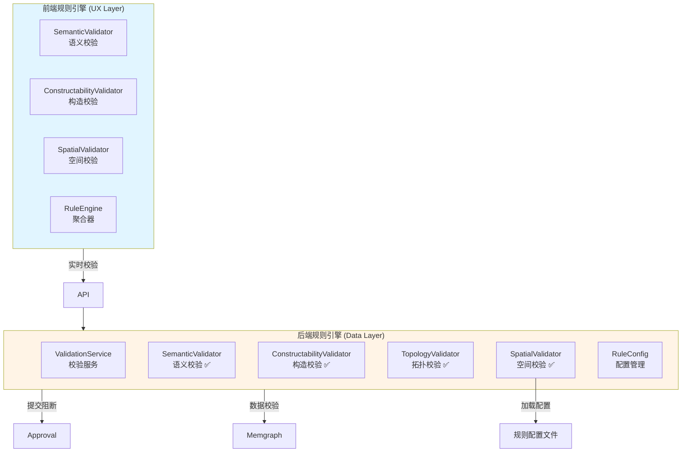

**核心职责**：

1. **检验批划分规则执行**（已有功能）：
   - 执行检验批划分规则
   - 自动聚合符合条件的构件
   - 创建 InspectionLot 节点
   - 建立节点关系

2. **数据质量校验**（分阶段实施）：
   - **规则引擎 Phase 1: 语义校验**：防止违反常识的连接（如：水管接柱子） - ✅ 已实现（OpenTruss Phase 2）
   - **规则引擎 Phase 2: 构造校验**：角度吸附、Z轴完整性检查 - ✅ 已实现（OpenTruss Phase 3）
   - **规则引擎 Phase 3: 空间校验**：物理碰撞检测（2.5D 包围盒） - ✅ 已实现（Beta 特性）
   - **规则引擎 Phase 4: 拓扑校验**：确保系统逻辑闭环（无悬空端点、无孤立子图） - ✅ 已实现（OpenTruss Phase 3）

**技术栈**：
- **前端**：TypeScript, Turf.js, RBush
- **后端**：Python, Memgraph (Cypher), Pydantic
- **配置**：JSON 配置文件（Rule as Code）

**与其他服务的交互**：

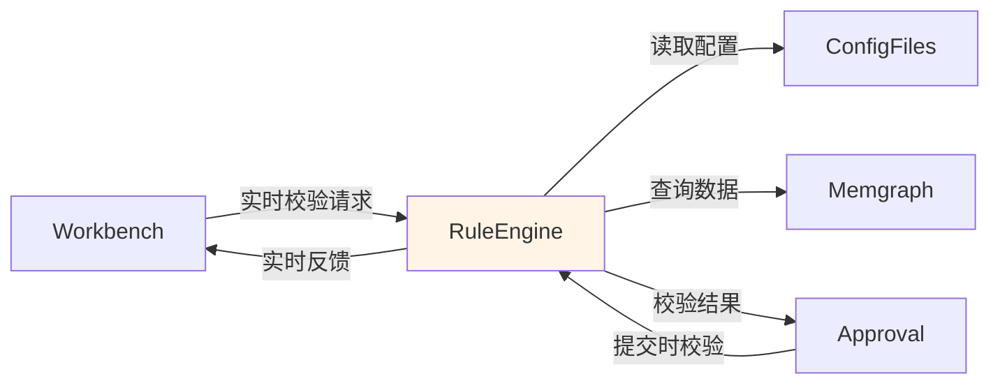

**规则示例**（检验批划分）：
```
IF Element.level_id == 'F1' 
AND Element.speckle_type == 'Wall'
AND Element.item_id == 'item_001'
THEN Assign To InspectionLot 'lot_001'
```

**校验规则示例**（语义校验）：
```python
# 语义连接白名单
semantic_allowlist = {
    "Objects.BuiltElements.Pipe": [
        "Objects.BuiltElements.Pipe",
        "Objects.BuiltElements.Valve",
        "Objects.BuiltElements.Pump"
    ]
}
```

#### 3.3.4 审批工作流服务 (Approval Service)

**实现状态**：✅ **已实现**（OpenTruss Phase 4）

**职责**：
- 管理检验批状态机（PLANNING → IN_PROGRESS → SUBMITTED → APPROVED → PUBLISHED）
- 验证完整性（高度、材质、闭合拓扑）
- 处理审批/驳回操作
- 记录审批历史

**状态转换规则**：
- `PLANNING` → `IN_PROGRESS`: 负责人手动更新
- `IN_PROGRESS` → `SUBMITTED`: 负责人提交，触发完整性验证和规则引擎校验
- `SUBMITTED` → `APPROVED`: 必须通过审批端点完成，由 APPROVER 角色执行
- `APPROVED` → `PUBLISHED`: 负责人手动更新
- 驳回操作：APPROVER 可将 `SUBMITTED` 驳回至 `IN_PROGRESS`；PM 可将 `SUBMITTED` 或 `APPROVED` 驳回至 `IN_PROGRESS` 或 `PLANNING`

**API 端点**：
- `POST /api/v1/lots/{lot_id}/approve` - 审批通过
- `POST /api/v1/lots/{lot_id}/reject` - 驳回检验批
- `GET /api/v1/lots/{lot_id}/approval-history` - 获取审批历史

**实现位置**：
- `backend/app/services/approval.py` - ApprovalService 服务
- `backend/app/api/v1/approval.py` - API 端点

#### 3.3.5 IFC 导出服务 (Export Service)

**实现状态**：✅ **已实现**（OpenTruss Phase 4）

**技术栈**：ifcopenshell

**职责**：
- 按检验批导出 IFC 模型（单个检验批）
- 批量导出多个检验批为单个 IFC 文件（合并导出）
- 导出整个项目的所有检验批
- 几何生成（2D → 3D Lift）
- IFC 文件生成与验证
- 支持 Revit/Navisworks 兼容性

**导出要求**：
- 检验批必须处于 `APPROVED` 状态
- 所有构件必须具有完整的几何信息（geometry, height, base_offset）
- 批量导出时，所有检验批必须属于同一个项目

**支持的 Speckle 类型映射**：
- Wall → IfcWall
- Column → IfcColumn
- Beam → IfcBeam
- Brace → IfcMember
- Floor → IfcSlab
- Roof → IfcRoof
- Ceiling → IfcCovering
- Duct → IfcDuctSegment
- Pipe → IfcPipeSegment
- CableTray → IfcCableSegment
- Conduit → IfcCableSegment

**API 端点**：
- `GET /api/v1/export/ifc?inspection_lot_id={id}` - 导出单个检验批
- `GET /api/v1/export/ifc?project_id={id}` - 导出整个项目
- `POST /api/v1/export/ifc/batch` - 批量导出多个检验批

**实现位置**：
- `backend/app/services/export.py` - ExportService 服务
- `backend/app/api/v1/export.py` - API 端点

#### 3.3.6 MEP 路由规划服务 (Routing Service)

**职责**：
- 2D 路由规划（Trace Mode）
- 轻量级路径点计算
- 支持系统特定约束（角度、转弯半径、宽度）
- Brick Schema 语义验证
- 障碍物查询和处理

**架构**：

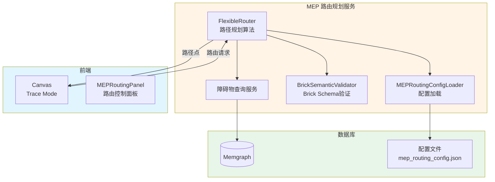

**核心功能**：
1. **路由规划**：计算符合约束的最短路径
2. **约束验证**：坡度、角度、转弯半径、宽度约束
3. **空间限制**：检查并避开禁止穿过的空间
4. **原始路由约束**：新路由不能经过原始路由未经过的房间（仅针对Room，非房间Space允许通过）
5. **分步路由规划**：支持按分项/系统/规格区间筛选

**Room和Space数据模型关系**：
- **Room（房间）**：具体的房间元素，存储在Memgraph中
- **Space（空间）**：MEP空间元素，包含房间空间和公共空间（如走廊、大厅等）
- **关联关系**：Space通过`room_id`字段关联到Room。如果`Space.room_id`存在，则该Space受原始路由约束限制；如果为None，则为非房间空间，允许作为更短路由使用
- **约束逻辑**：原始路由约束仅针对Room。Element的`original_route_room_ids`字段存储Room ID列表（不是Space ID），用于验证Room约束
- **设计决策**：区分Room和Space约束的目的是允许系统在非房间空间（走廊、大厅等）中优化路由，提高路由规划的灵活性

详细说明参见 [MEP_ROUTING_DETAILED.md](features/MEP_ROUTING_DETAILED.md#4-原始路由约束)。

#### 3.3.7 管线综合排布服务 (Coordination Service)

**职责**：
- 3D 管线综合排布
- 碰撞检测和避让
- 优先级管理
- 穿墙/穿楼板节点生成

**架构**：

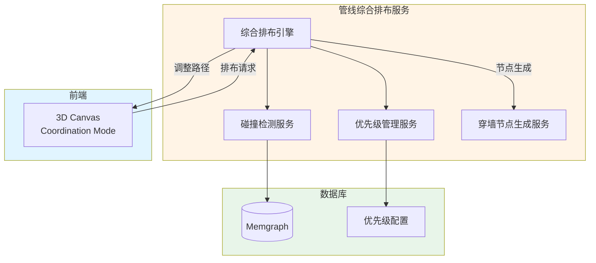

**核心功能**：
1. **碰撞检测**：MEP元素之间、MEP与结构之间的3D空间碰撞
2. **避障优先级**：5级系统优先级，支持用户自定义
3. **路径调整**：局部平移、垂直平移、增加翻弯
4. **目标优化**：避开碰撞 > 贴近顶板 > 少翻弯
5. **节点生成**：完成排布后生成防火封堵、防水套管等节点

详细说明参见 [MEP_COORDINATION.md](../features/MEP_COORDINATION.md) 和 [MEP_PENETRATION.md](../features/MEP_PENETRATION.md)。

### 3.4 数据层 (Data Layer)

#### 3.4.1 Memgraph (LPG 数据库)

**配置要求**：
- 内存：建议 8GB+（根据项目规模）
- 持久化：启用磁盘持久化
- 索引：为常用查询字段创建索引

**连接方式**：
- Bolt 协议（默认端口 7687）
- HTTP 协议（默认端口 7444）

**查询优化**：
- 使用索引加速查询
- 避免全图扫描
- 合理使用关系方向

#### 3.4.2 RDF 映射层

**职责**：
- 将 LPG 节点映射到 RDF 本体
- 支持 IFCOWL 导出
- 知识图谱对接准备

---

## 4. 数据流转

### 4.1 数据摄入流程

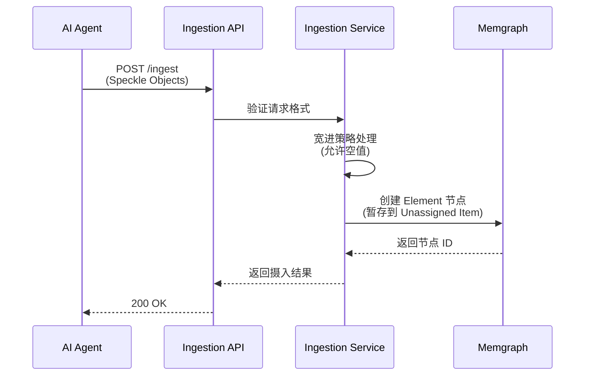

### 4.2 数据清洗流程

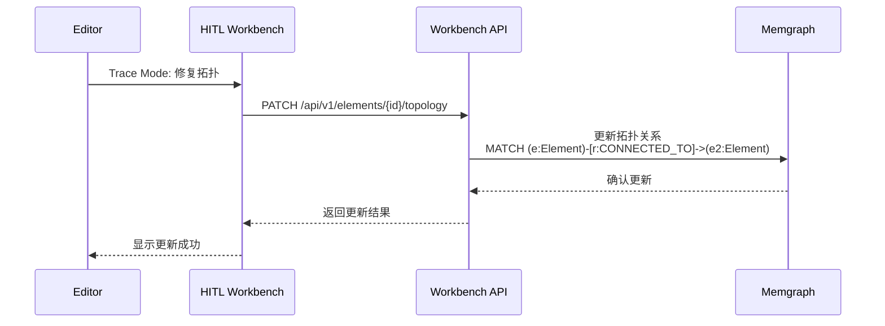

### 4.3 检验批创建流程

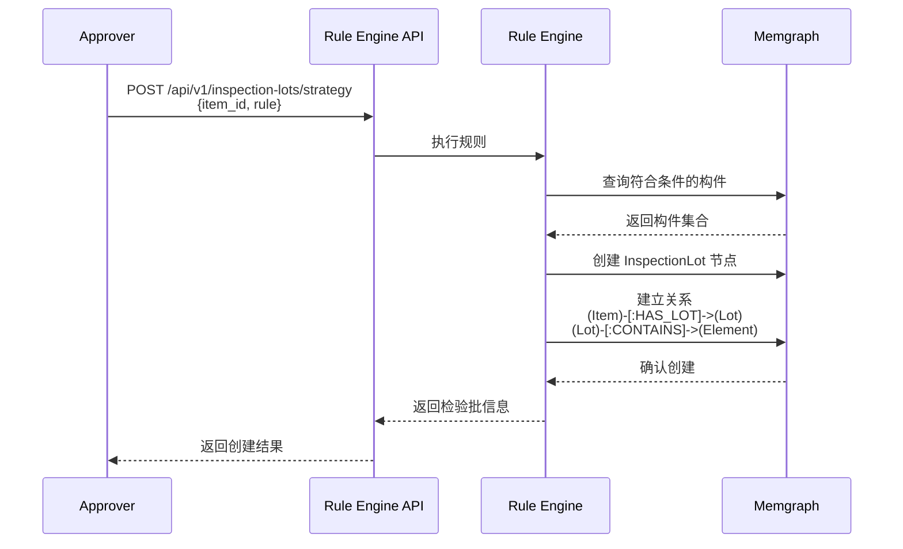

### 4.4 规则引擎校验流程

规则引擎在校验过程中分为**实时校验（前端）**和**提交校验（后端）**两个阶段。

#### 4.4.1 实时校验流程（前端）

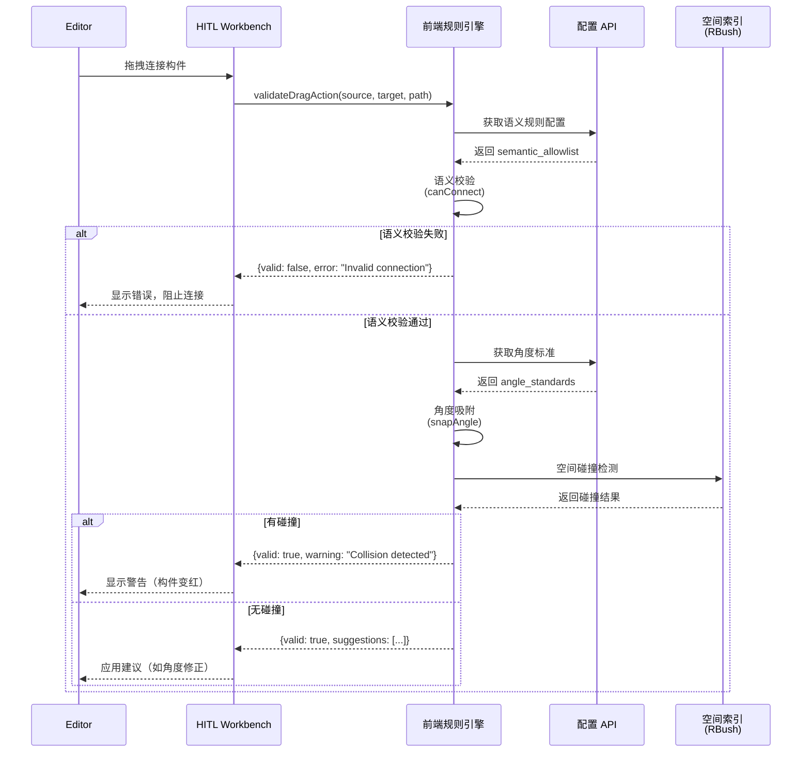

#### 4.4.2 提交校验流程（后端）

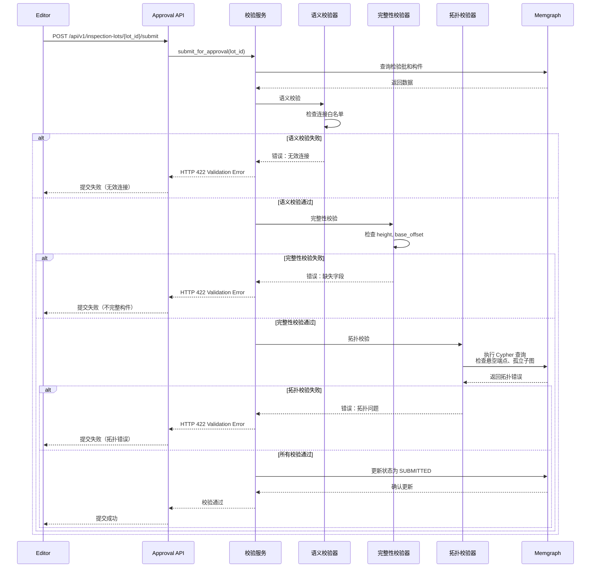

### 4.5 MEP路由规划和管线综合排布流程

MEP路由规划和管线综合排布是两阶段工作流，详细说明参见 [MEP_ROUTING_DETAILED.md](features/MEP_ROUTING_DETAILED.md) 和 [MEP_COORDINATION.md](features/MEP_COORDINATION.md)。

#### 4.5.1 路由规划流程（2D Trace Mode）

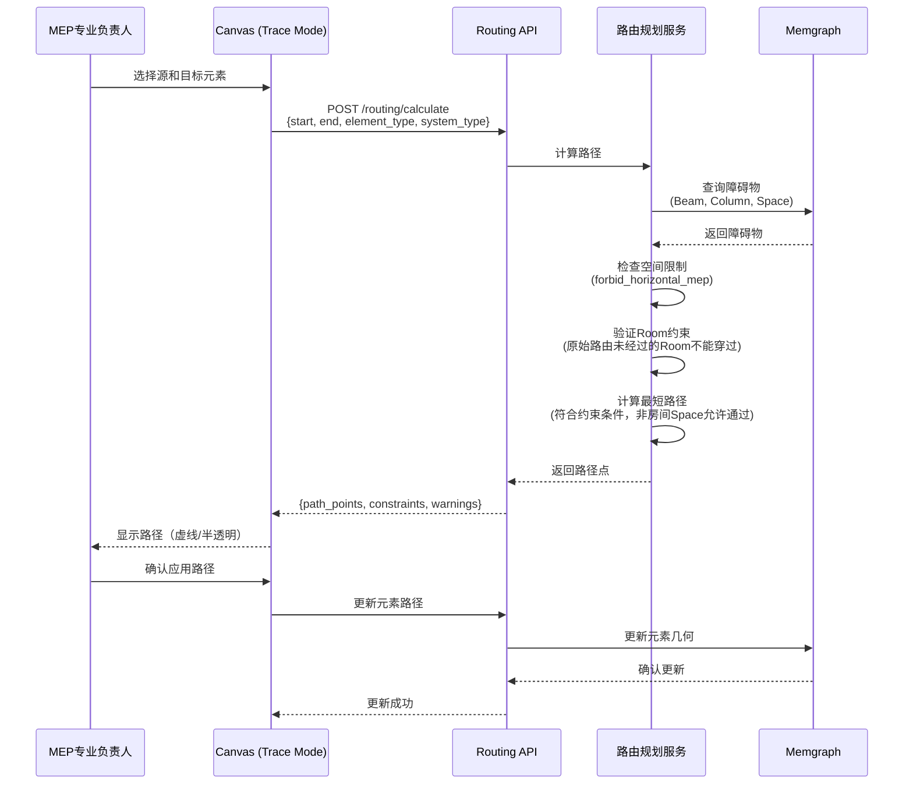

#### 4.5.2 管线综合排布流程（3D Coordination）

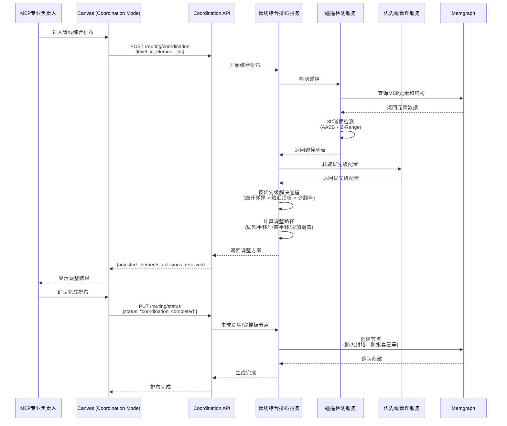

---

## 5. 技术栈选型

### 5.1 后端技术栈

| 组件 | 技术选型 | 版本要求 | 说明 |
|------|---------|---------|------|
| Web 框架 | FastAPI | 0.100+ | 高性能、自动 API 文档 |
| 图数据库 | Memgraph | 2.10+ | LPG 数据库，Cypher 查询 |
| Python 版本 | Python | 3.10+ | 类型注解支持 |
| 数据验证 | Pydantic | 2.0+ | 请求/响应验证 |
| IFC 处理 | ifcopenshell | 最新 | IFC 文件生成 |
| 异步框架 | asyncio | 内置 | 异步 I/O 支持 |

### 5.2 前端技术栈

| 组件 | 技术选型 | 版本要求 | 说明 |
|------|---------|---------|------|
| 框架 | Next.js | 14.0+ | React 框架，支持 SSR 和客户端渲染 |
| 样式 | Tailwind CSS | 4.0+ | 实用优先的 CSS 框架 |
| 语言 | TypeScript | 5.0+ | 类型安全 |
| 可视化 | D3.js | 7.0+ | 2D 拓扑可视化和图操作 |
| 图形渲染 | Canvas API | 原生 | 高性能图形渲染 |
| 状态管理 | Zustand | 4.0+ | 轻量级状态管理 |
| 字体 | JetBrains Mono | 最新 | 等宽字体，用于代码/ID 显示 |

### 5.3 基础设施

| 组件 | 技术选型 | 说明 |
|------|---------|------|
| 容器化 | Docker | 应用容器化 |
| 编排 | Docker Compose | 本地开发 |
| 反向代理 | Nginx | 生产环境 |
| 监控 | Prometheus + Grafana | 系统监控 |
| 日志 | ELK Stack | 日志聚合 |

---

## 6. 性能与扩展性

### 6.1 性能指标

- **API 响应时间**：P95 < 200ms
- **图查询性能**：复杂查询 < 100ms
- **前端交互响应**：拖拽操作 < 50ms
- **IFC 导出**：单检验批 < 5s

### 6.2 扩展性考虑

#### 6.2.1 水平扩展

- **API 层**：无状态设计，支持多实例部署
- **Memgraph**：支持主从复制（未来考虑）

#### 6.2.2 垂直扩展

- **Memgraph**：根据数据规模增加内存
- **API 服务**：根据并发量增加 CPU/内存

#### 6.2.3 数据分片

- 按 Project 分片（未来考虑）
- 按 Building 分片（大规模项目）

### 6.3 缓存策略

- **构件查询结果**：Redis 缓存（TTL: 5分钟）
- **层级树结构**：内存缓存（更新时失效）
- **规则引擎结果**：按规则哈希缓存

---

## 7. 安全考虑

### 7.1 认证与授权

- **认证方式**：JWT Token（HS256 算法）
- **授权模型**：基于角色的访问控制（RBAC）
- **部署模式**：单租户私有化部署（无需多租户隔离）
- **角色权限**：
  - Editor：数据清洗权限
  - Approver：审批权限
  - PM：监控和熔断权限
- **用户管理**：
  - 当前版本：用户信息存储在 Memgraph 或关系型数据库
  - 管理员通过初始化脚本创建用户
  - 未来可集成 LDAP/AD（企业内网场景）
- **会话策略**：
  - Token 有效期：1 小时（可配置）
  - 支持多设备并发登录
  - 当前版本无 Refresh Token 机制（需重新登录获取新 Token）
- **操作审计**：
  - 记录所有关键操作（登录、数据修改、审批、导出）
  - 审计日志存储在 Memgraph（AuditLog 节点）或关系型数据库
  - 提供审计日志查询 API（PM 权限）

### 7.2 数据安全

- **传输加密**：HTTPS（TLS 1.3）
- **数据加密**：敏感数据加密存储
- **访问控制**：项目级别的数据隔离

### 7.3 API 安全

- **限流**：防止 API 滥用
- **输入验证**：防止注入攻击
- **CORS 配置**：限制跨域访问

---

## 8. 监控与日志

### 8.1 监控指标

- **系统指标**：CPU、内存、磁盘 I/O
- **应用指标**：API 响应时间、错误率
- **业务指标**：检验批数量、审批进度

### 8.2 日志策略

- **日志级别**：DEBUG、INFO、WARNING、ERROR
- **日志格式**：JSON 格式，便于解析
- **日志聚合**：ELK Stack 集中管理

---

## 9. 未来扩展方向

### 9.1 知识图谱集成

- 对接外部知识图谱
- 支持语义查询
- 智能推荐功能

### 9.2 多租户支持

- 项目级别的数据隔离
- 资源配额管理
- 计费系统集成

### 9.3 实时协作

- WebSocket 支持
- 多人同时编辑
- 冲突解决机制

---

**最后更新**：2025-12-28  
**文档版本**：1.0  
**维护者**：OpenTruss 开发团队

