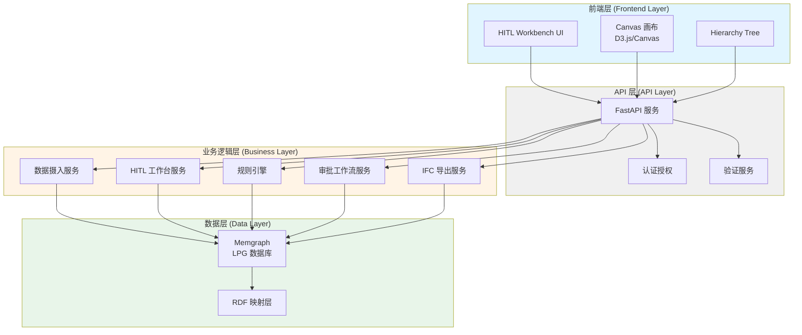
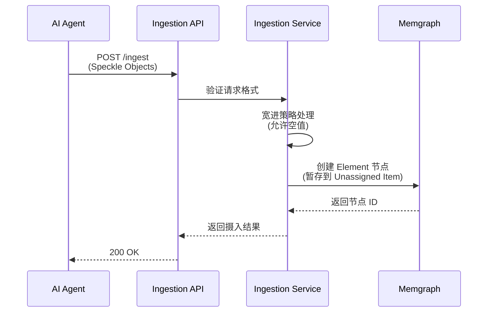
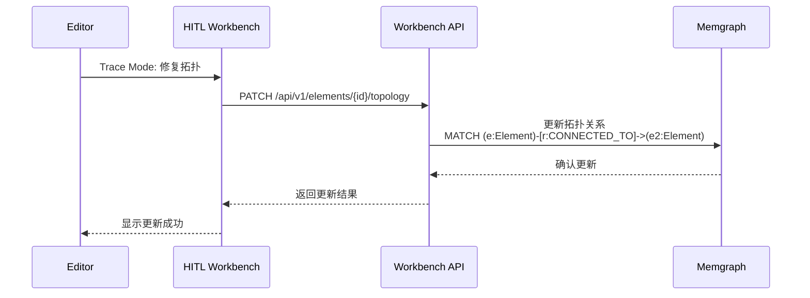
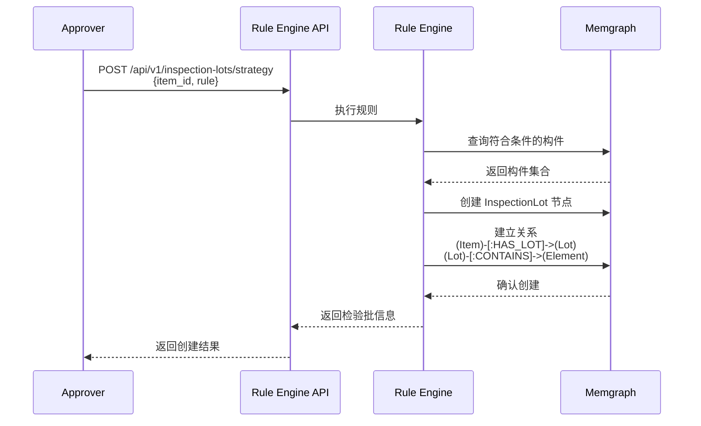

# OpenTruss 技术架构文档

## 1. 概述

OpenTruss 是一个面向建筑施工行业的生成式 BIM 中间件，采用 **"Graph First, Geometry Generated"**（图逻辑优先，几何由生成而来）的核心理念。

### 1.1 架构目标

- **高性能计算**：毫秒级响应前端交互（如拖拽墙体节点更新拓扑）
- **语义标准化**：确保数据符合 GB50300 国标和 IFC 标准
- **可扩展性**：支持大规模建筑项目的图数据管理
- **可维护性**：清晰的系统分层，便于开发和维护

---

## 2. 双模架构 (LPG + RDF Dual-Mode Architecture)

OpenTruss 的核心创新在于融合了两种图技术的优势：

### 2.1 Runtime Layer (LPG - 属性图)

**技术栈**：Memgraph (Cypher 查询语言)

**作用**：
- 高性能计算与状态管理
- 存储构件的几何属性、实时状态（Draft/Verified）、置信度
- 管理 2D 拓扑连接关系
- 支持复杂的图遍历查询

**典型场景**：
- 工程师在前端拖拽墙体节点时，LPG 负责毫秒级更新拓扑关系
- 规则引擎执行构件聚合查询
- 实时验证构件完整性

**数据特点**：
- 节点类型：Project, Building, Division, SubDivision, Item, InspectionLot, Element
- 关系类型：CONTAINS, HAS_LOT, LOCATED_AT, CONNECTED_TO
- 支持属性索引，优化查询性能

### 2.2 Semantic Layer (RDF - 资源描述框架)

**技术**：Ontology Mapping (本体映射)

**作用**：
- 语义标准化
- LPG 中的节点标签和关系严格映射 RDF 本体
- 确保未来可对接 Knowledge Graph
- 支持导出 IFCOWL（IFC Ontology Web Language）

**映射示例**：
```
LPG Node: :Building
RDF Mapping: bot:Building

LPG Node: :Element {speckle_type: "Wall"}
RDF Mapping: ifc:Wall

LPG Relationship: -[:CONTAINS]->
RDF Mapping: bot:containsElement
```

**优势**：
- 确保语义一致性
- 支持跨系统数据交换
- 便于知识图谱集成

---

## 3. 系统分层架构



### 3.1 前端层 (Frontend Layer)

**技术栈**：
- Next.js（React 框架，支持 SSR 和客户端渲染）
- Tailwind CSS (v4)（实用优先的 CSS 框架）
- D3.js（2D 拓扑可视化和图操作）
- Canvas API（高性能图形渲染）
- TypeScript（类型安全）

**核心组件**：
- **HITL Workbench**：主工作台界面
- **Hierarchy Tree**：左侧导航树（Building → ... → Item）
- **Canvas**：中间无限画布（Trace Mode）
- **Parameter Panel**：右侧参数修正面板
- **Toolbar**：顶部悬浮工具栏

**交互模式**：
- **Trace Mode**：修复 2D 拓扑
- **Lift Mode**：批量设置 Z 轴参数
- **Classify Mode**：拖拽构件归类

### 3.2 API 层 (API Layer)

**技术栈**：FastAPI (Python)

**职责**：
- RESTful API 端点定义
- 请求/响应验证（Pydantic）
- 认证与授权（JWT/OAuth2）
- 错误处理与日志记录
- API 版本管理

**关键模块**：
- 路由管理
- 中间件（CORS、认证、限流）
- 异常处理
- 响应格式化

### 3.3 业务逻辑层 (Business Layer)

#### 3.3.1 数据摄入服务 (Ingestion Service)

**职责**：
- 接收上游 AI Agent 的识别结果
- 实现"宽进严出"策略
- 数据格式转换（Speckle Objects → LPG Nodes）
- 暂存未分配构件到 Unassigned Item

**关键逻辑**：
```python
def ingest_elements(elements: List[SpeckleObject]) -> IngestResult:
    # 宽进：允许 height, material, inspection_lot_id 为空
    # 暂存：无法确定归属的构件挂载到 Unassigned Item
    pass
```

#### 3.3.2 HITL 工作台服务 (Workbench Service)

**职责**：
- 提供构件查询接口
- 支持 Trace/Lift/Classify 操作
- 实时更新拓扑关系
- 批量操作支持

#### 3.3.3 规则引擎 (Rule Engine)

**职责**：
- 执行检验批划分规则
- 自动聚合符合条件的构件
- 创建 InspectionLot 节点
- 建立节点关系

**规则示例**：
```
IF Element.level_id == 'F1' 
AND Element.speckle_type == 'Wall'
AND Element.item_id == 'item_001'
THEN Assign To InspectionLot 'lot_001'
```

#### 3.3.4 审批工作流服务 (Approval Service)

**职责**：
- 管理检验批状态机
- 验证完整性（高度、材质、闭合拓扑）
- 处理审批/驳回操作
- 发送通知

#### 3.3.5 IFC 导出服务 (Export Service)

**技术栈**：ifcopenshell

**职责**：
- 按检验批导出 IFC 模型
- 几何生成（2D → 3D Lift）
- IFC 文件生成与验证
- 支持 Revit/Navisworks 兼容性

### 3.4 数据层 (Data Layer)

#### 3.4.1 Memgraph (LPG 数据库)

**配置要求**：
- 内存：建议 8GB+（根据项目规模）
- 持久化：启用磁盘持久化
- 索引：为常用查询字段创建索引

**连接方式**：
- Bolt 协议（默认端口 7687）
- HTTP 协议（默认端口 7444）

**查询优化**：
- 使用索引加速查询
- 避免全图扫描
- 合理使用关系方向

#### 3.4.2 RDF 映射层

**职责**：
- 将 LPG 节点映射到 RDF 本体
- 支持 IFCOWL 导出
- 知识图谱对接准备

---

## 4. 数据流转

### 4.1 数据摄入流程



### 4.2 数据清洗流程



### 4.3 检验批创建流程



---

## 5. 技术栈选型

### 5.1 后端技术栈

| 组件 | 技术选型 | 版本要求 | 说明 |
|------|---------|---------|------|
| Web 框架 | FastAPI | 0.100+ | 高性能、自动 API 文档 |
| 图数据库 | Memgraph | 2.10+ | LPG 数据库，Cypher 查询 |
| Python 版本 | Python | 3.10+ | 类型注解支持 |
| 数据验证 | Pydantic | 2.0+ | 请求/响应验证 |
| IFC 处理 | ifcopenshell | 最新 | IFC 文件生成 |
| 异步框架 | asyncio | 内置 | 异步 I/O 支持 |

### 5.2 前端技术栈

| 组件 | 技术选型 | 版本要求 | 说明 |
|------|---------|---------|------|
| 框架 | Next.js | 14.0+ | React 框架，支持 SSR 和客户端渲染 |
| 样式 | Tailwind CSS | 4.0+ | 实用优先的 CSS 框架 |
| 语言 | TypeScript | 5.0+ | 类型安全 |
| 可视化 | D3.js | 7.0+ | 2D 拓扑可视化和图操作 |
| 图形渲染 | Canvas API | 原生 | 高性能图形渲染 |
| 状态管理 | Zustand | 4.0+ | 轻量级状态管理 |
| 字体 | JetBrains Mono | 最新 | 等宽字体，用于代码/ID 显示 |

### 5.3 基础设施

| 组件 | 技术选型 | 说明 |
|------|---------|------|
| 容器化 | Docker | 应用容器化 |
| 编排 | Docker Compose | 本地开发 |
| 反向代理 | Nginx | 生产环境 |
| 监控 | Prometheus + Grafana | 系统监控 |
| 日志 | ELK Stack | 日志聚合 |

---

## 6. 性能与扩展性

### 6.1 性能指标

- **API 响应时间**：P95 < 200ms
- **图查询性能**：复杂查询 < 100ms
- **前端交互响应**：拖拽操作 < 50ms
- **IFC 导出**：单检验批 < 5s

### 6.2 扩展性考虑

#### 6.2.1 水平扩展

- **API 层**：无状态设计，支持多实例部署
- **Memgraph**：支持主从复制（未来考虑）

#### 6.2.2 垂直扩展

- **Memgraph**：根据数据规模增加内存
- **API 服务**：根据并发量增加 CPU/内存

#### 6.2.3 数据分片

- 按 Project 分片（未来考虑）
- 按 Building 分片（大规模项目）

### 6.3 缓存策略

- **构件查询结果**：Redis 缓存（TTL: 5分钟）
- **层级树结构**：内存缓存（更新时失效）
- **规则引擎结果**：按规则哈希缓存

---

## 7. 安全考虑

### 7.1 认证与授权

- **认证方式**：JWT Token（HS256 算法）
- **授权模型**：基于角色的访问控制（RBAC）
- **部署模式**：单租户私有化部署（无需多租户隔离）
- **角色权限**：
  - Editor：数据清洗权限
  - Approver：审批权限
  - PM：监控和熔断权限
- **用户管理**：
  - 当前版本：用户信息存储在 Memgraph 或关系型数据库
  - 管理员通过初始化脚本创建用户
  - 未来可集成 LDAP/AD（企业内网场景）
- **会话策略**：
  - Token 有效期：1 小时（可配置）
  - 支持多设备并发登录
  - 当前版本无 Refresh Token 机制（需重新登录获取新 Token）
- **操作审计**：
  - 记录所有关键操作（登录、数据修改、审批、导出）
  - 审计日志存储在 Memgraph（AuditLog 节点）或关系型数据库
  - 提供审计日志查询 API（PM 权限）

### 7.2 数据安全

- **传输加密**：HTTPS（TLS 1.3）
- **数据加密**：敏感数据加密存储
- **访问控制**：项目级别的数据隔离

### 7.3 API 安全

- **限流**：防止 API 滥用
- **输入验证**：防止注入攻击
- **CORS 配置**：限制跨域访问

---

## 8. 监控与日志

### 8.1 监控指标

- **系统指标**：CPU、内存、磁盘 I/O
- **应用指标**：API 响应时间、错误率
- **业务指标**：检验批数量、审批进度

### 8.2 日志策略

- **日志级别**：DEBUG、INFO、WARNING、ERROR
- **日志格式**：JSON 格式，便于解析
- **日志聚合**：ELK Stack 集中管理

---

## 9. 未来扩展方向

### 9.1 知识图谱集成

- 对接外部知识图谱
- 支持语义查询
- 智能推荐功能

### 9.2 多租户支持

- 项目级别的数据隔离
- 资源配额管理
- 计费系统集成

### 9.3 实时协作

- WebSocket 支持
- 多人同时编辑
- 冲突解决机制

---

*文档版本：1.0*  
*最后更新：根据 PRD v4.0 创建*

