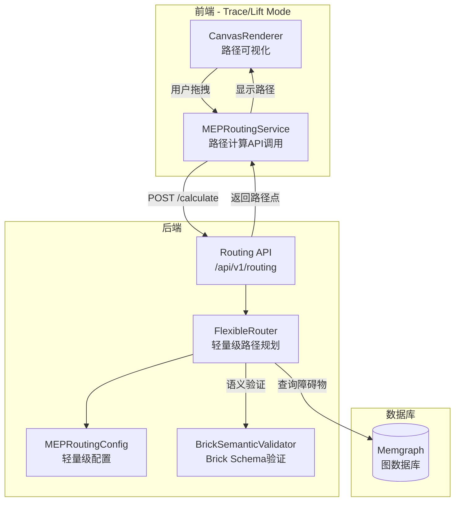

# MEP 路径规划系统

## 概述

MEP 路径规划系统是一个轻量级路径规划工具，支持不同 MEP 系统类型的特定约束。系统**只返回路径点，不生成具体配件**（配件生成作为独立功能，在导出或高精度模式时实现）。

> **详细规格**：本文档提供系统概述，详细规格请参考 [MEP_ROUTING_DETAILED.md](./MEP_ROUTING_DETAILED.md)。

## 核心特性

1. **轻量级路径规划**：Trace Mode/Lift Mode 只做路径点计算，不涉及具体配件生成
2. **Brick Schema 语义验证**：使用 Brick Schema 验证连接语义（feeds, feeds_from 等）
3. **系统特定约束**：
   - 重力排水系统：禁止90°弯头，使用双45°路径点模式
   - 转弯半径约束：根据管径/规格动态计算（管道、风管）
   - 宽度约束：电缆桥架采用宽度约束而非圆弧弯头
4. **配置驱动**：路径约束通过配置文件定义，不硬编码

## 架构



## 配置文件

### mep_routing_config.json

路径规划轻量级配置（不包含配件详细信息）：

```json
{
  "version": "2.0",
  "description": "MEP 路径规划轻量级配置（不包含配件详细信息）",
  "routing_constraints": {
    "Pipe": {
      "gravity_drainage": {
        "allowed_angles": [45, 180],
        "forbidden_angles": [90],
        "requires_double_45": true
      },
      "pressure_water": {
        "allowed_angles": [45, 90, 180],
        "forbidden_angles": []
      },
      "bend_radius_ratio_by_diameter": {
        "0-50": 1.0,
        "50-150": 1.5,
        "150-300": 2.0
      }
    },
    "CableTray": {
      "min_width_by_cable_bend_radius": {
        "0-50": 2.0,
        "50-150": 3.0
      },
      "note": "电缆桥架采用宽度约束，确保电缆转弯半径可通过"
    }
  }
}
```

### speckle_brick_mapping.json

Speckle 到 Brick 类型映射：

```json
{
  "mappings": {
    "Pipe": "brick:Water_Supply_Pipe",
    "Duct": "brick:Air_Duct",
    "CableTray": "brick:Cable_Tray"
  },
  "relationships": {
    "feeds": {
      "examples": [
        ["Pump", "Pipe"],
        ["Pipe", "Valve"]
      ]
    }
  }
}
```

## API 接口

### POST /api/v1/routing/calculate

计算路径。

**请求体**：
```json
{
  "start": [0.0, 0.0],
  "end": [10.0, 10.0],
  "element_type": "Pipe",
  "element_properties": {
    "diameter": 100
  },
  "system_type": "gravity_drainage",
  "source_element_type": "Pump",
  "target_element_type": "Pipe",
  "validate_semantic": true
}
```

**响应**：
```json
{
  "status": "success",
  "data": {
    "path_points": [[0.0, 0.0], [5.0, 0.0], [5.0, 5.0], [10.0, 10.0]],
    "constraints": {
      "bend_radius": 0.1,
      "pattern": "double_45"
    },
    "warnings": [],
    "errors": []
  }
}
```

**注意**：响应只包含路径点，不包含具体配件信息（弯头、三通等）。

### POST /api/v1/routing/validate

验证路径。

**请求体**：
```json
{
  "path_points": [[0.0, 0.0], [10.0, 10.0]],
  "element_type": "Pipe",
  "system_type": "gravity_drainage",
  "element_properties": {"diameter": 100},
  "source_element_type": "Pump",
  "target_element_type": "Pipe"
}
```

**响应**：
```json
{
  "status": "success",
  "data": {
    "valid": true,
    "semantic_valid": true,
    "constraint_valid": true,
    "errors": [],
    "warnings": [],
    "semantic_errors": [],
    "constraint_errors": []
  }
}
```

## 算法说明

### 双45°路径点生成

当检测到90°转弯且系统类型为 `gravity_drainage` 时：

1. 计算输入方向向量和输出方向向量
2. 在角点处插入第一个45°路径点（沿输入方向后退）
3. 计算45°方向（输入方向旋转45°）
4. 插入中间点（沿45°方向前进）
5. 插入第二个45°路径点（完成90°转向）

**只返回路径点坐标，不生成具体弯头配件**。

### 转弯半径约束（管道、风管）

根据元素规格（直径、宽度等）和配置的 `bend_radius_ratio` 计算最小转弯半径：

- 管道：`min_radius = diameter * radius_ratio`
- 风管：`min_radius = max(width, height) * radius_ratio`

使用圆弧路径替代直角转弯，确保满足最小转弯半径要求。

### 宽度约束（电缆桥架）

电缆桥架采用宽度约束，确保电缆转弯半径可通过：

- `min_width = cable_bend_radius * width_ratio`
- **不生成圆弧弯头**，而是确保桥架宽度足够

### Brick Schema 语义验证

使用 Brick Schema 验证连接语义：

```python
validator = BrickSemanticValidator()
can_connect = validator.can_connect(
    source_type="Pump",
    target_type="Pipe",
    relationship="feeds"
)
```

## 使用示例

### Python 后端

```python
from app.services.routing import FlexibleRouter

router = FlexibleRouter()

result = router.route(
    start=(0.0, 0.0),
    end=(10.0, 10.0),
    element_type="Pipe",
    element_properties={"diameter": 100},
    system_type="gravity_drainage"
)

path_points = result["path_points"]
constraints = result["constraints"]
```

### TypeScript 前端

```typescript
import { calculateMEPRoute } from '@/services/routing';

const result = await calculateMEPRoute(
  { x: 0, y: 0 },
  { x: 10, y: 10 },
  {
    elementType: 'Pipe',
    systemType: 'gravity_drainage',
    properties: { diameter: 100 }
  },
  'Pump',
  'Pipe'
);

// result.path_points 包含路径点
// result.constraints 包含约束信息
```

## 配件生成（独立功能）

**配件生成不在当前路径规划功能范围内**。

配件生成作为独立功能，在以下场景实现：

1. **IFC 导出时**：根据路径点和规范生成具体配件
2. **高精度模式**：根据规范和图集生成配件模型
3. **施工图生成**：根据图集生成详细的配件图纸

配件生成将根据规范和图集实现，不在此路径规划系统中硬编码。

## 测试

运行测试：

```bash
# 单元测试
pytest backend/tests/test_services/test_routing.py
pytest backend/tests/test_core/test_brick_validator.py

# 集成测试
pytest backend/tests/test_integration/test_routing_api.py
```

## 工作流程

### 两阶段流程

1. **路由规划阶段**（2D Trace Mode）
   - 在2D平面视图下进行水平MEP管线的路径规划
   - 竖向管线不参与自动路由规划，由MEP专业负责人手动调整
   - 水平管线必须穿过楼层内空间
   - 端点固定，不能调整
   - 目标：找出符合约束条件的最短路由
   - 约束：不能经过原始路由未经过的房间
   - 支持分步路由规划（按分项/系统/规格区间，可选组合）
   - 预览确认机制（虚线/半透明显示，确认后应用）

2. **管线综合排布阶段**（3D空间）
   - 在3D空间中进行管线综合排布，解决所有碰撞问题
   - 只通过小范围内水平/垂直平移局部管线或增加翻弯进行调整
   - 目标优先级：避开碰撞 > 贴近顶板 > 少翻弯
   - 梁、柱碰撞是最高优先级解决项
   - 可以随时退回2D路由规划阶段

详细说明见 [MEP_ROUTING_DETAILED.md](./MEP_ROUTING_DETAILED.md) 和 [MEP_COORDINATION.md](./MEP_COORDINATION.md)。

## 坡度属性

### 管道坡度

- **属性字段**：`Pipe.slope: Optional[float]`（百分比%）
- **定义**：正数表示向下（重力流），负数表示向上（倒坡）
- **重力流约束**：重力流管道必须 `slope > 0`（不能倒坡）
- **验证规则**：在路由规划时验证重力流管道的坡度是否符合要求

## 空间限制

### 空间禁止MEP管线穿过

- **属性字段**（Space模型）：
  - `forbid_horizontal_mep: bool` - 禁止水平MEP穿过
  - `forbid_vertical_mep: bool` - 禁止竖向MEP穿过
- **权限**：MEP专业负责人和总工可以设置
- **影响**：被禁止的空间将作为障碍物处理

## 竖向/水平管线区分

### 判定标准

- **竖向管线**：Z方向变化>1米（可在配置中设置阈值）
- **水平管线**：Z方向变化≤1米

### 处理方式

- **竖向管线**：不参与自动路由规划，由MEP专业负责人手动调整；在管线综合排布时贴近墙、柱
- **水平管线**：参与自动路由规划，必须穿过楼层内空间

## 原始路由约束

自动规划的新路由**不能经过原始路由未经过的房间**。

- **原始路由定义**：导入时的初始几何路径（从源元素到目标元素的初始路径）
- **约束逻辑**：如果原始路由经过房间A、B、C，新路由只能经过A、B、C的子集或全部

## 避障优先级系统

系统使用5级默认优先级（详细说明见 [MEP_SYSTEM_PRIORITY.md](./MEP_SYSTEM_PRIORITY.md)）：

1. 重力流管道（最高优先级）
2. 大截面风管
3. 大口径有压管道
4. 电缆桥架
5. 小口径有压管道及电线导管（最低优先级）

**优先级冲突处理**（相同优先级时）：
1. 少翻弯（优先）
2. 较小管径/截面积避让较大管径/截面积
3. 尽量贴近本楼层顶板

## 相关文档

- [MEP_ROUTING_DETAILED.md](./MEP_ROUTING_DETAILED.md) - MEP路由规划详细规格
- [MEP_COORDINATION.md](./MEP_COORDINATION.md) - 管线综合排布规格
- [MEP_SYSTEM_PRIORITY.md](./MEP_SYSTEM_PRIORITY.md) - MEP系统优先级配置
- [MEP_PENETRATION.md](./MEP_PENETRATION.md) - 穿墙/穿楼板节点生成规则
- [RULE_ENGINE.md](./RULE_ENGINE.md) - 规则引擎文档（包含Brick Schema语义验证）
- [API.md](./API.md) - API 文档
- [ARCHITECTURE.md](./ARCHITECTURE.md) - 架构文档

