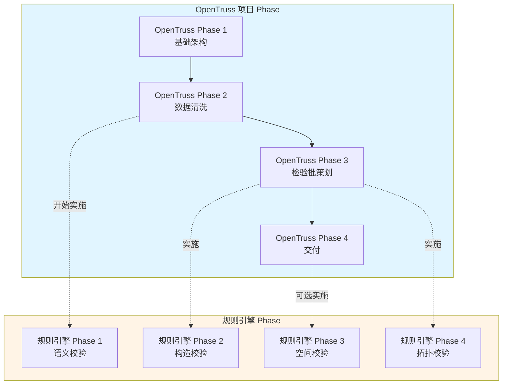

# OpenTruss Phase 编号体系参考

本文档提供 OpenTruss 项目中两套 Phase 编号体系的完整对比和说明，帮助开发者理解项目整体开发阶段和规则引擎功能开发阶段的关系。

## 1. OpenTruss 项目 Phase（项目整体开发阶段）

OpenTruss 项目按照功能模块划分为四个主要开发阶段：

| Phase | 名称 | 英文名称 | 说明 | 状态 |
|-------|------|---------|------|------|
| **OpenTruss Phase 1** | 基础架构 | Foundation & Hierarchy | 搭建 Memgraph/FastAPI，实现 GB50300 六级节点 Schema | ✅ 已完成 |
| **OpenTruss Phase 2** | 数据清洗 | Ingestion & Editor | 实现 Ingestion API，开发 HITL Workbench (Trace & Lift 功能) | 🚧 进行中 |
| **OpenTruss Phase 3** | 检验批策划 | The Approver's Tool | 开发 Lot Strategy UI，实现规则引擎（检验批划分） | 📋 待开发 |
| **OpenTruss Phase 4** | 交付 | Workflow & Export | 实现审批状态机，集成 ifcopenshell 编译器，按检验批导出 IFC | 📋 待开发 |

### 详细说明

- **OpenTruss Phase 1**: 建立项目的基础架构，包括数据库、API 框架和核心数据模型
- **OpenTruss Phase 2**: 实现数据摄入和人工交互编辑功能，支持工程师进行数据清洗
- **OpenTruss Phase 3**: 为专业负责人提供检验批策划工具，包括规则引擎（检验批划分）
- **OpenTruss Phase 4**: 实现完整的审批工作流和 IFC 导出功能

## 2. 规则引擎 Phase（规则引擎功能开发阶段）

规则引擎是 OpenTruss 的核心校验组件，其功能开发分为四个增量阶段：

| Phase | 名称 | 说明 | 优先级 | 实施阶段 |
|-------|------|------|--------|---------|
| **规则引擎 Phase 1** | 语义"防呆" | 防止违反常识的连接（如：水管接柱子） | 最高（MVP） | OpenTruss Phase 2 |
| **规则引擎 Phase 2** | 构造"规范化" | 角度吸附、Z轴完整性检查 | 高（Alpha） | OpenTruss Phase 3 |
| **规则引擎 Phase 3** | 空间"避障" | 物理碰撞检测（2.5D 包围盒） | 中（Beta） | OpenTruss Phase 4 |
| **规则引擎 Phase 4** | 拓扑"完整性" | 确保系统逻辑闭环（无悬空端点、无孤立子图） | 高（RC/Production） | OpenTruss Phase 3 |

### 详细说明

- **规则引擎 Phase 1**: 语义校验，防止违反常识的连接，是 MVP 必须功能
- **规则引擎 Phase 2**: 构造校验，解决 2D 到 3D 转换的合理性，提升用户体验
- **规则引擎 Phase 3**: 空间校验，物理碰撞检测，属于高级特性，可延后实施
- **规则引擎 Phase 4**: 拓扑校验，确保系统逻辑闭环，生产环境必须

## 3. 关系映射

规则引擎的开发是 OpenTruss 项目的一部分，两者的关系如下：

### 实施时间线

| OpenTruss Phase | 规则引擎 Phase | 说明 |
|----------------|---------------|------|
| **OpenTruss Phase 2** | 规则引擎 Phase 1 | 在数据清洗阶段开始实施语义校验，防止明显错误 |
| **OpenTruss Phase 3** | 规则引擎 Phase 2 | 在检验批策划阶段实施构造校验，提升数据质量 |
| **OpenTruss Phase 3** | 规则引擎 Phase 4 | 在检验批策划阶段实施拓扑校验，确保逻辑闭环 |
| **OpenTruss Phase 4** | 规则引擎 Phase 3 | 在交付阶段可选实施空间校验（高级特性） |

## 4. 命名约定

### 在文档中使用

- **项目整体阶段**：使用 "OpenTruss Phase X" 或完整名称
  - 示例：`OpenTruss Phase 2: Ingestion & Editor`
  
- **规则引擎阶段**：使用 "规则引擎 Phase X" 或 "Rule Engine Phase X"
  - 示例：`规则引擎 Phase 1: 语义校验`

### 在代码注释中使用（可选）

- **项目整体阶段**：`OT-P1`, `OT-P2`, `OT-P3`, `OT-P4`
- **规则引擎阶段**：`RE-P1`, `RE-P2`, `RE-P3`, `RE-P4`

## 5. 相关文档

- [产品需求文档 (PRD)](PRD.md) - 包含 OpenTruss Phase 的详细说明
- [规则引擎架构文档 (RULE_ENGINE.md)](RULE_ENGINE.md) - 包含规则引擎 Phase 的详细说明
- [技术架构文档 (ARCHITECTURE.md)](ARCHITECTURE.md) - 包含系统整体架构
- [开发指南 (DEVELOPMENT.md)](DEVELOPMENT.md) - 包含开发流程和规则引擎开发指南

---

**文档版本**：1.0  
**最后更新**：2024年  
**维护者**：OpenTruss 开发团队

