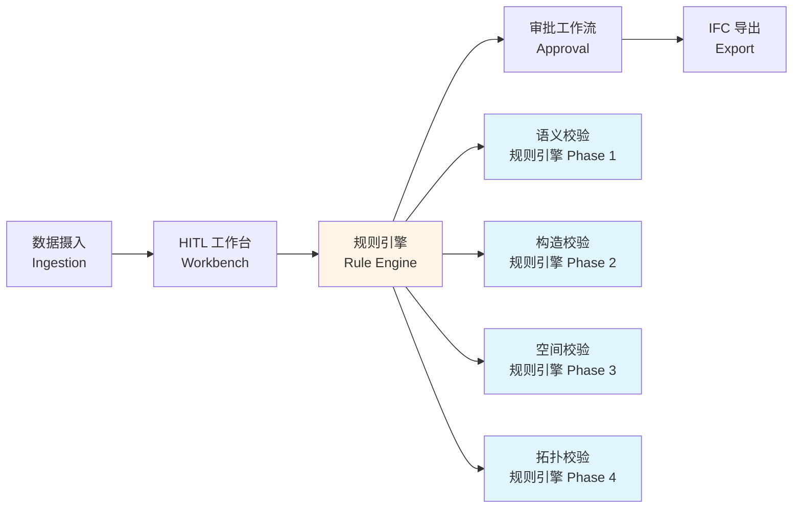
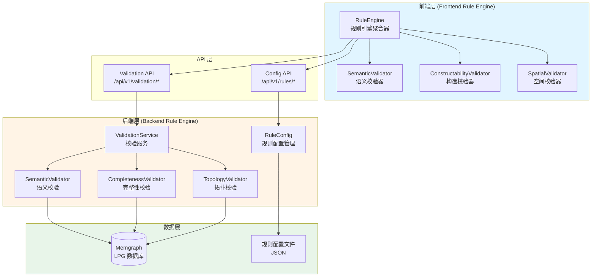
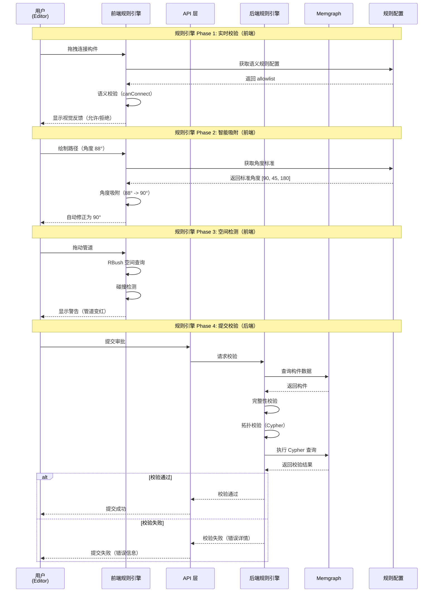
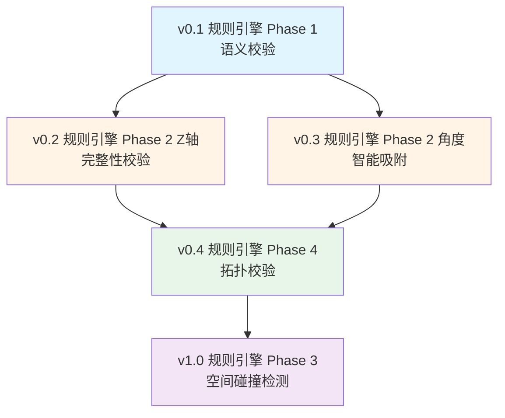

# OpenTruss 规则引擎架构与开发指南

## 0. Phase 编号体系说明

本文档中使用的 **"规则引擎 Phase"** 编号体系与 **"OpenTruss 项目 Phase"** 编号体系是不同的概念，请注意区分：

### OpenTruss 项目 Phase（项目整体开发阶段）

| Phase | 名称 | 说明 |
|-------|------|------|
| **OpenTruss Phase 1** | Foundation & Hierarchy | 基础架构：搭建 Memgraph/FastAPI，实现 GB50300 六级节点 Schema |
| **OpenTruss Phase 2** | Ingestion & Editor | 数据清洗：实现 Ingestion API，开发 HITL Workbench (Trace & Lift 功能) |
| **OpenTruss Phase 3** | The Approver's Tool | 检验批策划：开发 Lot Strategy UI，实现规则引擎（检验批划分） |
| **OpenTruss Phase 4** | Workflow & Export | 交付：实现审批状态机，集成 ifcopenshell 编译器，按检验批导出 IFC |

### 规则引擎 Phase（规则引擎功能开发阶段）

| Phase | 名称 | 说明 | 优先级 |
|-------|------|------|--------|
| **规则引擎 Phase 1** | 语义"防呆" | 防止违反常识的连接（如：水管接柱子） | 最高（MVP） |
| **规则引擎 Phase 2** | 构造"规范化" | 角度吸附、Z轴完整性检查 | 高（Alpha） |
| **规则引擎 Phase 3** | 空间"避障" | 物理碰撞检测（2.5D 包围盒） | 中（Beta） |
| **规则引擎 Phase 4** | 拓扑"完整性" | 确保系统逻辑闭环（无悬空端点、无孤立子图） | 高（RC/Production） |

### 关系说明

- **规则引擎 Phase 1-4** 是规则引擎功能的增量开发阶段，主要服务于 **OpenTruss Phase 2-4**
- 规则引擎 Phase 1（语义校验）可以在 OpenTruss Phase 2 开始实施
- 规则引擎 Phase 2-4 在 OpenTruss Phase 3-4 中逐步完善

---

## 1. 概述

### 1.1 核心目标

OpenTruss 规则引擎的核心目标是构建一个**轻量、可扩展、前后端协同的校验体系**，确保 **"垃圾进，精华出"**。

在 CAD-to-BIM 逆向重构流程中，规则引擎起到关键的**质量控制**作用：

- **输入阶段**：接收上游 AI Agent 的非结构化识别结果（可能包含错误、不完整的数据）
- **处理阶段**：通过多层次的规则校验，引导用户修正错误、补全缺失信息
- **输出阶段**：确保只有完整、合规的数据才能提交审批，最终生成符合 GB50300 国标的高质量 IFC 模型

### 1.2 规则引擎在系统中的作用

规则引擎是 OpenTruss 架构中的核心组件，贯穿整个数据处理流程：



### 1.3 前后端分层防御策略

OpenTruss 采用**分层防御策略**，而非"一套规则，两处运行"的冗余模式。前后端各司其职，形成多层校验防线：

| 层次 | 角色 | 技术栈 | 表现 | 目标 |
|------|------|--------|------|------|
| **前端 (UX Layer)** | 软引导 (Soft Guidance) | TypeScript, Turf.js, RBush | 鼠标吸附、变色、悬浮提示 | 让用户不容易犯错 |
| **后端 (Data Layer)** | 硬阻断 (Hard Blocking) | Python, Memgraph (Cypher), Pydantic | 提交审批时报错、数据库一致性检查 | 确保错误数据进不了生产库 |

**设计原则**：
- **前端**：实时反馈，预防错误，提升用户体验
- **后端**：严格校验，数据完整性保障，防止恶意/错误数据入库

---

## 2. 架构设计

### 2.1 前后端分工原则

#### 2.1.1 前端职责 (UX Layer)

**技术栈**：
- TypeScript：类型安全
- Turf.js：几何计算（角度、距离、相交检测）
- RBush：空间索引（R-Tree），毫秒级查询

**主要功能**：
- **实时校验**：用户交互过程中即时反馈（拖拽、连接、修改参数）
- **视觉提示**：通过颜色、图标、提示信息引导用户操作
- **智能吸附**：自动修正角度、距离到标准值
- **性能要求**：所有前端校验必须在 **<16ms (一帧)** 内完成

**典型场景**：
```typescript
// 用户拖动管道端点靠近柱子时
onDrag(element: Element, target: Element) {
  const isValid = semanticValidator.canConnect(element.type, target.type);
  if (!isValid) {
    // 不显示磁吸光圈，提示"无法连接"
    showWarning("管道无法连接到柱子");
  }
}
```

#### 2.1.2 后端职责 (Data Layer)

**技术栈**：
- Python：服务端逻辑
- Memgraph (Cypher)：图数据库查询，拓扑完整性检查
- Pydantic：数据验证与类型检查

**主要功能**：
- **提交阻断**：审批提交前进行严格校验，不通过则拒绝状态变更
- **数据一致性**：确保数据库中的数据结构完整、关系正确
- **拓扑校验**：检查图结构的完整性（无悬空端点、无孤立子图等）
- **业务规则**：执行复杂的业务逻辑校验（如检验批划分规则）

**典型场景**：
```python
# 提交审批时的校验
def submit_for_approval(lot_id: str):
    elements = get_lot_elements(lot_id)
    
    # 语义校验
    for connection in get_connections(elements):
        if not semantic_validator.is_valid(connection):
            raise ValidationError(f"Invalid connection: {connection}")
    
    # 完整性校验
    incomplete = check_completeness(elements)
    if incomplete:
        raise ValidationError(f"Incomplete elements: {incomplete}")
    
    # 拓扑校验
    topology_errors = check_topology(elements)
    if topology_errors:
        raise ValidationError(f"Topology errors: {topology_errors}")
    
    # 所有校验通过，允许状态变更
    update_lot_status(lot_id, "SUBMITTED")
```

### 2.2 规则引擎分层架构



### 2.3 数据流



---

## 3. 四个开发阶段详细说明

### 规则引擎 Phase 1: 语义"防呆" (MVP)

**目标**：防止违反常识的连接（如：水管接柱子、风管接墙）。

**优先级**：最高（MVP 必须功能）

#### 3.1.1 规则定义

**配置文件**：`backend/app/config/rules/semantic_allowlist.json`

**逻辑**：白名单机制（Allowlist）。未定义的连接即为非法。

**配置结构**：
```json
{
  "version": "1.0",
  "rules": {
    "semantic_allowlist": {
      "Objects.BuiltElements.Pipe": [
        "Objects.BuiltElements.Pipe",
        "Objects.BuiltElements.Valve",
        "Objects.BuiltElements.Pump",
        "Objects.BuiltElements.Tank"
      ],
      "Objects.BuiltElements.Wall": [
        "Objects.BuiltElements.Wall",
        "Objects.BuiltElements.Column"
      ],
      "Objects.BuiltElements.Duct": [
        "Objects.BuiltElements.Duct",
        "Objects.BuiltElements.AirTerminal",
        "Objects.BuiltElements.Fan"
      ]
    }
  }
}
```

#### 3.1.2 前端实现

**文件位置**：`frontend/src/lib/rules/SemanticValidator.ts`

**功能**：拖拽连线时的实时校验

**代码示例**：
```typescript
// frontend/src/lib/rules/SemanticValidator.ts

export interface SemanticAllowlist {
  [sourceType: string]: string[];
}

export class SemanticValidator {
  private allowlist: SemanticAllowlist;

  constructor(allowlist: SemanticAllowlist) {
    this.allowlist = allowlist;
  }

  /**
   * 检查两种类型的构件是否可以连接
   * @param sourceType 源构件类型
   * @param targetType 目标构件类型
   * @returns 是否可以连接
   */
  canConnect(sourceType: string, targetType: string): boolean {
    const allowed = this.allowlist[sourceType];
    if (!allowed) {
      // 未定义的类型，默认不允许连接
      return false;
    }
    return allowed.includes(targetType);
  }

  /**
   * 批量检查连接
   * @param connections 连接列表 [{sourceType, targetType}]
   * @returns 无效连接的列表
   */
  validateConnections(connections: Array<{sourceType: string; targetType: string}>): Array<{sourceType: string; targetType: string; reason: string}> {
    const invalid: Array<{sourceType: string; targetType: string; reason: string}> = [];
    
    for (const conn of connections) {
      if (!this.canConnect(conn.sourceType, conn.targetType)) {
        invalid.push({
          ...conn,
          reason: `Invalid connection: ${conn.sourceType} cannot connect to ${conn.targetType}`
        });
      }
    }
    
    return invalid;
  }
}
```

**集成点**：`frontend/src/components/canvas/CanvasRenderer.tsx`

**使用示例**：
```typescript
// 在拖拽事件处理中
const handleElementDrag = (element: Element, targetElement: Element) => {
  const validator = new SemanticValidator(semanticAllowlist);
  const canConnect = validator.canConnect(element.type, targetElement.type);
  
  if (!canConnect) {
    // 不显示磁吸光圈
    setSnapIndicator(null);
    showWarning(`无法连接：${element.type} 不能连接到 ${targetElement.type}`);
    return;
  }
  
  // 允许连接，显示磁吸效果
  setSnapIndicator(targetElement.id);
};
```

**效果**：
- 当用户拖动管线端点靠近柱子时，不显示磁吸光圈
- 强制释放会弹回
- 显示提示："管道无法连接到柱子"

#### 3.1.3 后端实现

**文件位置**：`backend/app/services/validation.py`

**功能**：提交审批时的严格校验

**代码示例**：
```python
# backend/app/services/validation.py

from typing import List, Dict, Any
from pathlib import Path
import json

class SemanticValidator:
    """语义校验器"""
    
    def __init__(self, config_path: Path):
        """初始化语义校验器
        
        Args:
            config_path: 规则配置文件路径
        """
        with open(config_path, 'r', encoding='utf-8') as f:
            config = json.load(f)
        self.allowlist = config['rules']['semantic_allowlist']
    
    def can_connect(self, source_type: str, target_type: str) -> bool:
        """检查两种类型的构件是否可以连接
        
        Args:
            source_type: 源构件类型
            target_type: 目标构件类型
            
        Returns:
            bool: 是否可以连接
        """
        allowed = self.allowlist.get(source_type)
        if not allowed:
            return False
        return target_type in allowed
    
    def validate_connection(self, source_type: str, target_type: str) -> Dict[str, Any]:
        """验证连接并返回详细结果
        
        Args:
            source_type: 源构件类型
            target_type: 目标构件类型
            
        Returns:
            Dict: 验证结果
                - valid: 是否有效
                - reason: 原因（如果无效）
        """
        if self.can_connect(source_type, target_type):
            return {
                "valid": True,
                "reason": None
            }
        else:
            return {
                "valid": False,
                "reason": f"Invalid connection: {source_type} cannot connect to {target_type}"
            }
    
    def validate_batch_connections(self, connections: List[Dict[str, str]]) -> List[Dict[str, Any]]:
        """批量验证连接
        
        Args:
            connections: 连接列表 [{"source_type": "...", "target_type": "..."}]
            
        Returns:
            List[Dict]: 无效连接的列表
        """
        invalid = []
        for conn in connections:
            result = self.validate_connection(conn['source_type'], conn['target_type'])
            if not result['valid']:
                invalid.append({
                    **conn,
                    "reason": result['reason']
                })
        return invalid
```

**API 端点**：`POST /api/v1/validation/semantic-check`

**API 实现**：
```python
# backend/app/api/v1/validation.py

from fastapi import APIRouter, Depends, HTTPException
from app.services.validation import SemanticValidator
from app.models.api.validation import SemanticCheckRequest, SemanticCheckResponse

router = APIRouter()

@router.post("/semantic-check", response_model=SemanticCheckResponse)
async def semantic_check(
    request: SemanticCheckRequest,
    validator: SemanticValidator = Depends(get_semantic_validator)
):
    """语义连接校验
    
    检查构件类型之间的连接是否合法
    """
    invalid = validator.validate_batch_connections(request.connections)
    
    if invalid:
        raise HTTPException(
            status_code=422,
            detail={
                "code": "INVALID_CONNECTIONS",
                "message": "存在无效的连接",
                "invalid_connections": invalid
            }
        )
    
    return SemanticCheckResponse(valid=True)
```

**集成点**：`backend/app/services/approval.py` (提交审批时调用)

**集成示例**：
```python
# backend/app/services/approval.py

def submit_for_approval(self, lot_id: str, user_id: str) -> Dict[str, Any]:
    """提交检验批审批"""
    # ... 获取检验批和构件 ...
    
    # 语义校验
    semantic_validator = SemanticValidator(config_path)
    connections = self._extract_connections(elements)
    invalid_connections = semantic_validator.validate_batch_connections(connections)
    
    if invalid_connections:
        raise ValueError(f"Invalid connections detected: {invalid_connections}")
    
    # ... 继续其他校验 ...
```

**效果**：
- 提交审批时，如果存在无效连接（如 Pipe -> Column），会报错
- 错误信息：`"Error: Invalid Connection (Pipe -> Column)"`
- 阻止状态变更，要求用户修正后再提交

---

### 规则引擎 Phase 2: 构造"规范化" (Alpha)

**实现状态**：✅ **已实现**（OpenTruss Phase 3）

**目标**：解决 2D 到 3D 的转换合理性（如：角度吸附、管径匹配、Z轴完整性）。

**优先级**：高（Alpha 版本核心功能）

#### 3.2.1 规则定义

**配置文件**：`backend/app/config/rules/fitting_standards.json`

**内容**：定义允许的角度容差、Z轴完整性要求等

**实际配置结构**（已实现）：
```json
{
  "version": "1.0",
  "description": "构造标准配置（规则引擎 Phase 2）",
  "angles": {
    "standard": [45, 90, 180],
    "tolerance": 5,
    "allow_custom": false,
    "description": "标准角度列表（度）和容差（度），如果 allow_custom 为 false，则只允许标准角度"
  },
  "z_axis": {
    "require_height": true,
    "require_base_offset": true,
    "element_types": ["Wall", "Column"],
    "description": "Z轴完整性要求：对于指定的元素类型，必须同时提供 height 和 base_offset"
  }
}
```

#### 3.2.2 前端实现（智能吸附）✅ 已实现

**文件位置**：`frontend/src/lib/rules/ConstructabilityValidator.ts`

**功能**：拖拽结束时的角度自动吸附

**集成位置**：`frontend/src/components/canvas/Canvas.tsx`（在 `handleElementDragEnd` 中调用）

**代码示例**：
```typescript
// frontend/src/lib/rules/ConstructabilityValidator.ts

export interface AngleStandards {
  standard: number[];      // 标准角度列表
  tolerance: number;       // 容差（度）
  allowCustom: boolean;    // 是否允许非标角度
}

export class ConstructabilityValidator {
  private angleStandards: AngleStandards;

  constructor(angleStandards: AngleStandards) {
    this.angleStandards = angleStandards;
  }

  /**
   * 角度吸附
   * @param currentAngle 当前角度（度）
   * @returns 吸附后的角度，如果无法吸附则返回原角度或 null
   */
  snapAngle(currentAngle: number): number | null {
    const { standard, tolerance, allowCustom } = this.angleStandards;
    
    // 查找最接近的标准角度
    for (const stdAngle of standard) {
      const diff = Math.abs(currentAngle - stdAngle);
      if (diff <= tolerance) {
        return stdAngle;
      }
    }
    
    // 如果允许自定义角度，返回原角度
    if (allowCustom) {
      return currentAngle;
    }
    
    // 否则返回 null，表示拒绝
    return null;
  }

  /**
   * 计算路径角度
   * @param path 路径坐标 [[x1, y1], [x2, y2], ...]
   * @returns 角度（度）
   */
  calculatePathAngle(path: number[][]): number {
    if (path.length < 2) return 0;
    
    const [start, end] = [path[0], path[path.length - 1]];
    const dx = end[0] - start[0];
    const dy = end[1] - start[1];
    
    // 计算角度（0-360度）
    let angle = Math.atan2(dy, dx) * (180 / Math.PI);
    if (angle < 0) angle += 360;
    
    // 转换为 0-180 度范围（因为 180° 和 360° 等价）
    if (angle > 180) angle -= 180;
    
    return angle;
  }
}
```

**集成点**：拖拽结束事件处理

**使用示例**：
```typescript
// 在拖拽结束事件中
const handleDragEnd = (element: Element, newPath: number[][]) => {
  const validator = new ConstructabilityValidator(angleStandards);
  const currentAngle = validator.calculatePathAngle(newPath);
  const snappedAngle = validator.snapAngle(currentAngle);
  
  if (snappedAngle === null) {
    // 角度不符合标准，拒绝更新
    showError("角度不符合标准，请重新绘制");
    return;
  }
  
  if (snappedAngle !== currentAngle) {
    // 需要修正角度
    const correctedPath = adjustPathAngle(newPath, snappedAngle);
    updateElementGeometry(element.id, correctedPath);
    showInfo(`角度已自动修正：${currentAngle.toFixed(1)}° → ${snappedAngle}°`);
  } else {
    // 角度已符合标准
    updateElementGeometry(element.id, newPath);
  }
};
```

**效果**：
- 用户画了一个 88° 的线，松手后自动变成 90°
- 显示提示："角度已自动修正：88° → 90°"

#### 3.2.3 后端实现 ✅ 已实现

**文件位置**：`backend/app/core/validators.py` - `ConstructabilityValidator` 类

**功能**：
- 角度验证和吸附：`validate_angle()`, `snap_angle()`, `calculate_path_angle()`
- Z轴完整性检查：`validate_z_axis_completeness()`

**逻辑**：这是"逆向重构"特有的规则。如果发现 height == null，拒绝将状态变更为 SUBMITTED

**API 端点**（已实现）：
- `POST /api/v1/validation/constructability/validate-angle` - 验证角度
- `POST /api/v1/validation/constructability/validate-z-axis` - 验证Z轴完整性
- `POST /api/v1/validation/constructability/calculate-path-angle` - 计算路径角度

**集成位置**：
- `backend/app/api/v1/lots.py` - 在 `update_lot_status` 中，当状态转换为 SUBMITTED 时自动调用

**代码示例**（实际实现）：
```python
# backend/app/core/validators.py

class ConstructabilityValidator:
    """构造校验器（规则引擎 Phase 2）
    
    实现角度吸附和Z轴完整性检查
    """
    
    def __init__(self, config_path: Path):
        """初始化完整性校验器
        
        Args:
            config_path: 规则配置文件路径
        """
        with open(config_path, 'r', encoding='utf-8') as f:
            config = json.load(f)
        z_axis_rules = config['rules']['fitting_standards']['z_axis']
        self.require_height = z_axis_rules['require_height']
        self.require_base_offset = z_axis_rules['require_base_offset']
        self.element_types = z_axis_rules.get('element_types', [])
    
    def validate_element_completeness(self, element: Dict[str, Any]) -> Dict[str, Any]:
        """验证单个构件的完整性
        
        Args:
            element: 构件数据
            
        Returns:
            Dict: 验证结果
                - valid: 是否完整
                - missing_fields: 缺失的字段列表
        """
        missing = []
        element_type = element.get('speckle_type', '')
        
        # 检查是否需要 Z 轴信息
        if element_type in self.element_types:
            if self.require_height and element.get('height') is None:
                missing.append('height')
            if self.require_base_offset and element.get('base_offset') is None:
                missing.append('base_offset')
        
        return {
            "valid": len(missing) == 0,
            "missing_fields": missing
        }
    
    def validate_batch_completeness(self, elements: List[Dict[str, Any]]) -> Dict[str, Any]:
        """批量验证构件完整性
        
        Args:
            elements: 构件列表
            
        Returns:
            Dict: 验证结果
                - valid: 是否全部完整
                - incomplete_elements: 不完整的构件列表
        """
        incomplete = []
        for element in elements:
            result = self.validate_element_completeness(element)
            if not result['valid']:
                incomplete.append({
                    "element_id": element.get('id'),
                    "missing_fields": result['missing_fields']
                })
        
        return {
            "valid": len(incomplete) == 0,
            "incomplete_elements": incomplete
        }
```

**集成点**：状态变更检查（如 IN_PROGRESS -> SUBMITTED）

**集成示例**：
```python
# backend/app/services/approval.py

def submit_for_approval(self, lot_id: str, user_id: str) -> Dict[str, Any]:
    """提交检验批审批"""
    # ... 获取检验批和构件 ...
    
    # Z轴完整性校验
    completeness_validator = CompletenessValidator(config_path)
    completeness_result = completeness_validator.validate_batch_completeness(elements)
    
    if not completeness_result['valid']:
        raise ValueError(
            f"Incomplete elements: {completeness_result['incomplete_elements']}"
        )
    
    # ... 继续其他校验 ...
```

**效果**：
- 如果发现 Wall 或 Column 的 height == null，拒绝将状态变更为 SUBMITTED
- 错误信息：`"Incomplete elements: [{'element_id': 'element_001', 'missing_fields': ['height']}]"`

---

### 规则引擎 Phase 3: 空间"避障" (Beta)

**实现状态**：✅ **已实现**

**目标**：简单的物理碰撞检测（无需重型 3D 引擎）。

**优先级**：中（Beta 版本高级特性）

#### 3.3.1 核心算法：2.5D 包围盒

**策略**：不使用 Mesh 碰撞，使用 **AABB (Axis-Aligned Bounding Box) + Z-Range**

**数据结构**：
```typescript
interface BoundingBox3D {
  minX: number;
  minY: number;
  minZ: number;
  maxX: number;
  maxY: number;
  maxZ: number;
}
```

**逻辑**：两个 Box 重叠 ⟺ X轴重叠 && Y轴重叠 && Z轴重叠

**代码示例**：
```typescript
// frontend/src/lib/rules/SpatialValidator.ts

export interface BoundingBox3D {
  minX: number;
  minY: number;
  minZ: number;
  maxX: number;
  maxY: number;
  maxZ: number;
}

export class SpatialValidator {
  /**
   * 检查两个 3D 包围盒是否重叠
   * @param box1 第一个包围盒
   * @param box2 第二个包围盒
   * @returns 是否重叠
   */
  boxesOverlap(box1: BoundingBox3D, box2: BoundingBox3D): boolean {
    // X 轴重叠
    const xOverlap = box1.maxX >= box2.minX && box1.minX <= box2.maxX;
    
    // Y 轴重叠
    const yOverlap = box1.maxY >= box2.minY && box1.minY <= box2.maxY;
    
    // Z 轴重叠
    const zOverlap = box1.maxZ >= box2.minZ && box1.minZ <= box2.maxZ;
    
    return xOverlap && yOverlap && zOverlap;
  }

  /**
   * 从构件数据计算 3D 包围盒
   * @param element 构件数据
   * @returns 3D 包围盒
   */
  calculateBoundingBox(element: Element): BoundingBox3D {
    const geometry2d = element.geometry_2d;
    const height = element.height || 0;
    const baseOffset = element.base_offset || 0;
    
    // 计算 2D 包围盒
    const coords = geometry2d.coordinates;
    let minX = Infinity, minY = Infinity;
    let maxX = -Infinity, maxY = -Infinity;
    
    for (const [x, y] of coords) {
      minX = Math.min(minX, x);
      minY = Math.min(minY, y);
      maxX = Math.max(maxX, x);
      maxY = Math.max(maxY, y);
    }
    
    // 转换为 3D 包围盒
    return {
      minX,
      minY,
      minZ: baseOffset,
      maxX,
      maxY,
      maxZ: baseOffset + height
    };
  }
}
```

#### 3.3.2 前端实现（实时警告）

**技术**：利用 **RBush** 库实现毫秒级查询

**数据结构**：将画布上所有构件插入 RBush 树

**代码示例**：
```typescript
// frontend/src/lib/rules/SpatialValidator.ts

import RBush from 'rbush';

interface SpatialIndexItem {
  minX: number;
  minY: number;
  maxX: number;
  maxY: number;
  elementId: string;
  element: Element;
}

export class SpatialIndex {
  private tree: RBush<SpatialIndexItem>;
  private spatialValidator: SpatialValidator;
  private elementMap: Map<string, Element>;

  constructor() {
    this.tree = new RBush();
    this.spatialValidator = new SpatialValidator();
    this.elementMap = new Map();
  }

  /**
   * 插入构件到空间索引
   * @param element 构件
   */
  insert(element: Element): void {
    const bbox = this.spatialValidator.calculateBoundingBox(element);
    
    // RBush 使用 2D 索引（minX, minY, maxX, maxY）
    const item: SpatialIndexItem = {
      minX: bbox.minX,
      minY: bbox.minY,
      maxX: bbox.maxX,
      maxY: bbox.maxY,
      elementId: element.id,
      element: element
    };
    
    this.tree.insert(item);
    this.elementMap.set(element.id, element);
  }

  /**
   * 移除构件
   * @param elementId 构件 ID
   */
  remove(elementId: string): void {
    const element = this.elementMap.get(elementId);
    if (!element) return;
    
    const bbox = this.spatialValidator.calculateBoundingBox(element);
    const item: SpatialIndexItem = {
      minX: bbox.minX,
      minY: bbox.minY,
      maxX: bbox.maxX,
      maxY: bbox.maxY,
      elementId: elementId,
      element: element
    };
    
    this.tree.remove(item, (a, b) => a.elementId === b.elementId);
    this.elementMap.delete(elementId);
  }

  /**
   * 搜索与给定包围盒重叠的构件
   * @param bbox 查询包围盒
   * @returns 重叠的构件列表
   */
  search(bbox: BoundingBox3D): Element[] {
    // 使用 2D 查询（RBush 不支持 3D）
    const candidates = this.tree.search({
      minX: bbox.minX,
      minY: bbox.minY,
      maxX: bbox.maxX,
      maxY: bbox.maxY
    });
    
    // 过滤出 Z 轴也重叠的构件
    const overlaps: Element[] = [];
    for (const candidate of candidates) {
      const candidateElement = this.elementMap.get(candidate.elementId);
      if (!candidateElement) continue;
      
      const candidateBbox = this.spatialValidator.calculateBoundingBox(candidateElement);
      if (this.spatialValidator.boxesOverlap(bbox, candidateBbox)) {
        overlaps.push(candidateElement);
      }
    }
    
    return overlaps;
  }

  /**
   * 检查碰撞
   * @param element 待检查的构件
   * @returns 碰撞的构件列表
   */
  checkCollision(element: Element): Element[] {
    const bbox = this.spatialValidator.calculateBoundingBox(element);
    const overlaps = this.search(bbox);
    
    // 排除自身
    return overlaps.filter(e => e.id !== element.id);
  }
}
```

**集成点**：拖拽过程中 (onDragMove)

**使用示例**：
```typescript
// 在拖拽移动事件中
const handleDragMove = (element: Element, newPath: number[][]) => {
  // 临时更新构件几何
  const tempElement = { ...element, geometry_2d: { ...element.geometry_2d, coordinates: newPath } };
  
  // 检查碰撞
  const spatialIndex = getSpatialIndex();
  const collisions = spatialIndex.checkCollision(tempElement);
  
  if (collisions.length > 0) {
    // 显示警告：管道变红
    setElementColor(element.id, 'red');
    showWarning(`碰撞检测：与 ${collisions[0].id} 发生重叠`);
  } else {
    // 恢复正常颜色
    setElementColor(element.id, 'default');
  }
};
```

**效果**：
- 拖动管道穿过柱子时，管道变红
- 显示警告："碰撞检测：与 column_001 发生重叠"

#### 3.3.3 性能优化建议

1. **使用 RBush 2D 索引 + Z 轴过滤**：RBush 是 2D 索引，先用 2D 查询候选，再用 Z 轴过滤
2. **增量更新**：只更新移动的构件，而不是重建整个索引
3. **防抖处理**：拖拽过程中使用防抖，避免每帧都进行碰撞检测
4. **Web Worker**：复杂的碰撞检测可以放到 Web Worker 中执行

---

### 规则引擎 Phase 4: 拓扑"完整性" (RC / Production)

**实现状态**：✅ **已实现**（OpenTruss Phase 3）

**目标**：确保系统逻辑闭环（如：没有悬空的管道端点、无孤立子图）。

**优先级**：高（生产环境必须功能）

#### 3.4.1 规则定义（图逻辑）

这些规则运行在 **Memgraph 图数据库**中，使用 **Cypher 查询语言**。

**规则 1 (Open Ends)**：管道端点必须连接到某个设备或另一根管道（除非标记为 Cap/堵头）

**规则 2 (Islands)**：系统中不应存在孤立的子图（比如一根管子谁也不连）

#### 3.4.2 后端实现（Cypher 校验）✅ 已实现

**文件位置**：`backend/app/core/validators.py` - `TopologyValidator` 类

**主要方法**：
- `validate_topology(lot_id)` - 验证检验批的拓扑完整性
- `find_open_ends(element_ids)` - 查找悬空端点（连接数 < 2 的元素）
- `find_isolated_elements(element_ids)` - 查找孤立元素（连接数为 0 的元素）

**API 端点**（已实现）：
- `POST /api/v1/validation/topology/validate` - 验证拓扑完整性
- `POST /api/v1/validation/topology/find-open-ends` - 查找悬空端点
- `POST /api/v1/validation/topology/find-isolated` - 查找孤立元素

**集成位置**：
- `backend/app/api/v1/lots.py` - 在 `update_lot_status` 中，当状态转换为 SUBMITTED 时自动调用
- `frontend/src/components/validation/TopologyValidationPanel.tsx` - 前端校验结果展示面板

**代码示例**（实际实现）：
```python
# backend/app/core/validators.py

class TopologyValidator:
    """拓扑校验器（规则引擎 Phase 4）
    
    确保系统逻辑闭环：无悬空端点、无孤立子图
    """
    
    def __init__(self, client):
        """初始化拓扑校验器
        
        Args:
            client: MemgraphClient 实例
        """
        self.client = client
    
    def validate_topology(self, lot_id: str) -> Dict[str, Any]:
        """验证检验批的拓扑完整性
        
        Args:
            lot_id: 检验批 ID
        
        Returns:
            {
                "valid": bool,
                "open_ends": List[str],  # 悬空端点元素ID列表
                "isolated_elements": List[str],  # 孤立元素ID列表
                "errors": List[str]
            }
        """
        # ... 实现代码 ...
    
    def find_open_ends(self, element_ids: List[str]) -> List[str]:
        """查找悬空端点（连接数 < 2 的元素）
        
        Args:
            element_ids: 元素ID列表
        
        Returns:
            悬空端点元素ID列表
        """
        # 实际实现：使用 Cypher 查询查找连接数 < 2 的元素
            # 只检查指定检验批的构件
            query = """
            MATCH (lot:InspectionLot {id: $lot_id})-[:CONTAINS]->(e:Element)-[r:CONNECTED_TO]-(target)
            WITH e, count(r) as degree
            WHERE degree < 2 AND e.speckle_type IN ['Pipe', 'Duct']
            AND (e.tags IS NULL OR NOT 'Cap' IN e.tags)
            RETURN e.id as element_id, degree, 'Open pipe end detected' as reason
            """
            params = {"lot_id": lot_id}
        else:
            # 检查所有构件
            query = """
            MATCH (e:Element)-[r:CONNECTED_TO]-(target)
            WITH e, count(r) as degree
            WHERE degree < 2 AND e.speckle_type IN ['Pipe', 'Duct']
            AND (e.tags IS NULL OR NOT 'Cap' IN e.tags)
            RETURN e.id as element_id, degree, 'Open pipe end detected' as reason
            """
            params = {}
        
        results = self.client.execute_query(query, params)
        return results
    
    def find_isolated_subgraphs(self, lot_id: Optional[str] = None) -> List[Dict[str, Any]]:
        """查找孤立的子图
        
        规则：系统中不应存在孤立的子图
        
        Args:
            lot_id: 检验批 ID（可选）
            
        Returns:
            List[Dict]: 孤立子图列表
        """
        if lot_id:
            query = """
            MATCH (lot:InspectionLot {id: $lot_id})-[:CONTAINS]->(e:Element)
            WHERE NOT (e)-[:CONNECTED_TO]-()
            RETURN e.id as element_id, 'Isolated element' as reason
            """
            params = {"lot_id": lot_id}
        else:
            query = """
            MATCH (e:Element)
            WHERE NOT (e)-[:CONNECTED_TO]-()
            RETURN e.id as element_id, 'Isolated element' as reason
            """
            params = {}
        
        results = self.client.execute_query(query, params)
        return results
    
    def validate_topology(self, lot_id: Optional[str] = None) -> Dict[str, Any]:
        """验证拓扑完整性
        
        Args:
            lot_id: 检验批 ID（可选）
            
        Returns:
            Dict: 验证结果
                - valid: 是否有效
                - open_ends: 悬空端点列表
                - isolated_elements: 孤立构件列表
        """
        open_ends = self.find_open_ends(lot_id)
        isolated = self.find_isolated_subgraphs(lot_id)
        
        return {
            "valid": len(open_ends) == 0 and len(isolated) == 0,
            "open_ends": open_ends,
            "isolated_elements": isolated
        }
```

**集成点**：提交审批时调用

**集成示例**：
```python
# backend/app/services/approval.py

def submit_for_approval(self, lot_id: str, user_id: str) -> Dict[str, Any]:
    """提交检验批审批"""
    # ... 获取检验批和构件 ...
    
    # 拓扑完整性校验
    topology_validator = TopologyValidator(self.client)
    topology_result = topology_validator.validate_topology(lot_id)
    
    if not topology_result['valid']:
        raise ValueError(
            f"Topology errors detected: "
            f"open_ends={topology_result['open_ends']}, "
            f"isolated={topology_result['isolated_elements']}"
        )
    
    # ... 继续其他校验 ...
```

**API 端点**：`GET /api/v1/validation/topology-check?lot_id={lot_id}`

**API 实现**：
```python
# backend/app/api/v1/validation.py

@router.get("/topology-check", response_model=TopologyCheckResponse)
async def topology_check(
    lot_id: Optional[str] = None,
    validator: TopologyValidator = Depends(get_topology_validator)
):
    """拓扑完整性校验
    
    检查是否存在悬空端点或孤立子图
    """
    result = validator.validate_topology(lot_id)
    
    return TopologyCheckResponse(
        valid=result['valid'],
        open_ends=result['open_ends'],
        isolated_elements=result['isolated_elements']
    )
```

#### 3.4.3 前端展示（Triage Queue）

**功能**：在左侧"分诊列表"中，列出 "Topology Warnings"

**逻辑**：调用后端校验 API

**代码示例**：
```typescript
// frontend/src/components/triage/TriageQueue.tsx

import { useQuery } from '@tanstack/react-query';

interface TopologyWarning {
  element_id: string;
  reason: string;
}

export function TriageQueue({ lotId }: { lotId: string }) {
  const { data: topologyWarnings } = useQuery<TopologyWarning[]>({
    queryKey: ['topology-warnings', lotId],
    queryFn: async () => {
      const response = await fetch(`/api/v1/validation/topology-check?lot_id=${lotId}`);
      const data = await response.json();
      
      const warnings: TopologyWarning[] = [
        ...data.open_ends.map((item: any) => ({
          element_id: item.element_id,
          reason: item.reason
        })),
        ...data.isolated_elements.map((item: any) => ({
          element_id: item.element_id,
          reason: item.reason
        }))
      ];
      
      return warnings;
    },
    refetchInterval: 5000 // 每 5 秒刷新一次
  });

  return (
    <div className="triage-queue">
      <h3>分诊列表</h3>
      
      {topologyWarnings && topologyWarnings.length > 0 && (
        <div className="warning-section">
          <h4>拓扑警告 (Topology Warnings)</h4>
          <ul>
            {topologyWarnings.map((warning) => (
              <li
                key={warning.element_id}
                onClick={() => focusElement(warning.element_id)}
                className="warning-item"
              >
                <span className="warning-icon">⚠️</span>
                <span>{warning.element_id}: {warning.reason}</span>
              </li>
            ))}
          </ul>
        </div>
      )}
    </div>
  );
}
```

**效果**：
- 在左侧"分诊列表"中，列出 "Topology Warnings"
- 点击列表项，画布自动聚焦到悬空的端点，并闪烁提示

---

## 4. 开发排期

### 4.1 迭代版本规划

| 迭代版本 | 重点模块 | 交付物 | 备注 |
|---------|---------|--------|------|
| **v0.1** | 规则引擎 Phase 1 (语义) | SemanticValidator.ts | 必须阻止水管接墙/柱 |
| **v0.2** | 规则引擎 Phase 2 (Z轴) | ZMissingCheck (后端) | 确保 Ingestion 数据能被补全 |
| **v0.3** | 规则引擎 Phase 2 (角度) | AngleSnapper (前端) | 提升绘图手感 |
| **v0.4** | 规则引擎 Phase 4 (拓扑) | Cypher 校验脚本 | 辅助 HITL 查漏补缺 |
| **v1.0** | 规则引擎 Phase 3 (空间) | RBush 集成 | 属于高级特性，可延后 |

### 4.2 依赖关系



**说明**：
- 规则引擎 Phase 1 是基础，必须先实现
- 规则引擎 Phase 2 的两个功能（Z轴、角度）可以并行开发
- 规则引擎 Phase 4 依赖 Phase 1 和 Phase 2
- 规则引擎 Phase 3 可以最后实现，因为它是高级特性

---

## 5. 参考资源清单

为了避免"造轮子"，OpenTruss 的校验逻辑（Validator）应基于成熟的行业本体和开源算法构建。

### 5.1 语义约束 (Semantic Constraints)

**解决问题**：防止"水管接柱子"、"风管接水泵"等逻辑错误。

#### 核心参考：Brick Schema (强烈推荐)

**简介**：Brick 是目前全球最主流的建筑元数据本体（Ontology），专门用于定义物理、逻辑和虚拟资产之间的关系。

**为什么适合 OpenTruss**：
- 它定义了标准的关系，如 `feeds` (供给), `feeds_from` (被供给), `controls` (控制)
- 它定义了设备类型层级，明确了 HVAC_Zone 和 VAV_Box 的关系

**如何使用**：
- 不要自己写 `if (type == 'Pipe')`
- 而是导入 Brick 的 `.ttl` 文件到 Memgraph
- 查询时检查：`ASK { ?a brick:feeds ?b }`。如果 Brick 定义里没有这种连接可能性，则报错

**资源地址**：
- [Brick Schema GitHub](https://github.com/BrickSchema/Brick)
- [Brick 官方文档](https://brickschema.org/)

#### 辅助参考：RealEstateCore (REC)

**简介**：微软 Azure Digital Twins 背后的本体标准。

**参考点**：它的 Space 和 BuildingComponent 之间的拓扑定义非常严谨（如 `isPartOf`, `isLocatedIn`），适合用来校验构件的空间归属。

### 5.2 Brick Schema 集成实现

**状态**：已实现（v2.0）

**实现位置**：
- `backend/app/core/brick_validator.py` - Brick Schema 验证器
- `backend/app/core/speckle_brick_mapping.json` - Speckle 到 Brick 类型映射

**功能**：
- 使用 Brick Schema 验证 MEP 连接的语义正确性
- 支持 `feeds`, `feeds_from`, `controls`, `located_in` 等关系验证
- 集成到路径规划系统中，确保连接语义正确

**使用示例**：
```python
from app.core.brick_validator import get_brick_validator

validator = get_brick_validator()
result = validator.validate_mep_connection(
    source_type="Pump",
    target_type="Pipe",
    relationship="feeds"
)
```

详见 [MEP_ROUTING.md](./MEP_ROUTING.md)。

**资源地址**：
- [RealEstateCore GitHub](https://github.com/RealEstateCore/rec)

### 5.4 MEP路由规划规则

**状态**：已实现（v2.1）

**实现位置**：
- `backend/app/core/mep_routing_config.py` - MEP路由配置加载器
- `backend/app/core/brick_validator.py` - Brick Schema验证器（已包含）
- `backend/app/services/routing.py` - 路由规划服务
- `backend/app/core/validators.py` - MEP路由验证器（扩展）

**功能**：
- 坡度验证（重力流管道必须 slope > 0）
- 空间限制验证（禁止穿过的空间）
- 碰撞检测规则（MEP与MEP、MEP与结构）
- 避障优先级规则（5级系统）
- 竖向/水平管线判定规则
- 原始路由约束规则

详细说明参见本文档的 "MEP路由规划规则" 部分和 [MEP_ROUTING_DETAILED.md](./MEP_ROUTING_DETAILED.md)。

### 5.2 构造约束 (Constructability Constraints)

**解决问题**：防止"27°怪异弯头"、"不存在的管径"等制造错误。

#### 核心参考：Revit Lookup Tables (查表法)

**工业标准**：Revit MEP 处理弯头时，不是靠算，是靠查表 (CSV Lookup)。

**逻辑**：
- 厂商会提供 `.csv` 文件，列出所有生产出的弯头规格（如：45°, 90°）
- 算法逻辑：`if (current_angle NOT IN lookup_table) -> Error/Snap`

**OpenTruss 实现**：
- 在后端维护一个简单的 JSON 配置文件 `standard_fittings.json`
- 前端拖拽时，计算角度，寻找 `standard_fittings` 中最近的值进行吸附

**参考数据源**：
- 搜索 "ASHRAE Duct Fitting Database"
- 国内的《通风与空调工程施工质量验收规范》(GB 50243)

#### 算法参考：Manhattan Routing (正交路由)

**简介**：电路板设计（EDA）和 MEP 管道设计共用的算法，强制路径走"曼哈顿距离"（直角转弯）。

**开源库**：
- **NetworkX (Python)**：用于后端计算复杂的图路径
- **Obstacle-avoidance routing**：搜索相关的 GitHub 仓库，很多基于 A* 算法变体的实现
- **WebCola (JS)**：前端用于生成正交连线的布局算法

### 5.3 物理/空间约束 (Spatial Constraints)

**解决问题**：防止"管道穿过天井"、"构件重叠"。

#### 核心参考：TopologicPy

**简介**：专为建筑空间拓扑设计的 Python 库。

**强项**：它引入了 Cell (房间/空间) 和 Complex (复合体) 的概念。

**场景**：
- 用它来定义"天井"是一个 Void Cell
- 当管道路径（Line）穿过 Void Cell 时，Topologic 能直接检测出 `Topology.Intersects` 并返回真

**资源地址**：
- [TopologicPy GitHub](https://github.com/wassimj/Topologic)

#### 基础算法：R-Tree (空间索引)

**简介**：处理数万个构件碰撞检测的基础设施。

**库推荐**：
- **RBush (TypeScript)**：前端极其高效的 2D 矩形索引。用户拖动管道时，用 RBush 瞬间找出周围 50mm 内所有的墙和柱子，进行吸附或报错
- **rtree (Python)**：后端对应的库

---

## 6. 开发者指南

### 6.1 Rule as Code 原则

**原则**：将规则配置（JSON）视为代码的一部分，进行版本管理。

**实践**：
- 规则配置文件纳入 Git 版本控制
- 配置文件变更需要代码审查
- 使用语义化版本号管理规则配置版本
- 提供配置迁移脚本，支持规则版本升级

**配置文件位置**：
```
backend/app/config/rules/
  ├── semantic_allowlist.json      # 语义规则
  ├── fitting_standards.json        # 构造标准
  └── version.json                  # 版本信息
```

### 6.2 性能要求

**前端校验性能要求**：所有前端校验必须在 **<16ms (一帧)** 内完成。

**优化策略**：
1. **空间索引**：使用 RBush 进行空间查询，避免 O(n²) 的暴力检测
2. **防抖处理**：拖拽过程中使用防抖，避免每帧都进行校验
3. **Web Worker**：复杂的几何计算（如大量构件的碰撞检测）请使用 Web Worker
4. **简化为包围盒计算**：优先使用 AABB 包围盒，避免复杂的 Mesh 碰撞
5. **增量更新**：只更新变化的部分，而不是全量校验

**示例**：
```typescript
// 使用防抖处理拖拽校验
const debouncedValidate = debounce((element: Element) => {
  const collisions = spatialIndex.checkCollision(element);
  if (collisions.length > 0) {
    showWarning(`碰撞检测：${collisions.length} 个冲突`);
  }
}, 50); // 50ms 防抖

// 在拖拽事件中
onDragMove(element) {
  debouncedValidate(element);
}
```

### 6.3 Override 机制设计

**原则**：永远给用户留一个"强制执行"的后门，因为现实世界的改造项目总有非标情况。

**实现方式**：
1. **快捷键**：按住 `Alt` 键忽略吸附
2. **右键菜单**：提供"忽略校验"选项
3. **配置开关**：允许用户在项目级别关闭某些校验规则
4. **审批流程**：非标连接需要 Approver 审批确认

**代码示例**：
```typescript
// 前端角度吸附时的 Override
const handleDragEnd = (element: Element, newPath: number[][], modifiers: KeyboardModifiers) => {
  const validator = new ConstructabilityValidator(angleStandards);
  const currentAngle = validator.calculatePathAngle(newPath);
  
  // 如果按住 Alt 键，跳过角度吸附
  if (modifiers.alt) {
    updateElementGeometry(element.id, newPath);
    return;
  }
  
  const snappedAngle = validator.snapAngle(currentAngle);
  // ... 正常处理 ...
};
```

### 6.4 测试策略

#### 6.4.1 单元测试

**前端测试**：
```typescript
// frontend/src/lib/rules/__tests__/SemanticValidator.test.ts

import { SemanticValidator } from '../SemanticValidator';

describe('SemanticValidator', () => {
  const allowlist = {
    'Objects.BuiltElements.Pipe': ['Objects.BuiltElements.Pipe', 'Objects.BuiltElements.Valve']
  };
  
  const validator = new SemanticValidator(allowlist);
  
  test('should allow valid connections', () => {
    expect(validator.canConnect('Objects.BuiltElements.Pipe', 'Objects.BuiltElements.Valve')).toBe(true);
  });
  
  test('should reject invalid connections', () => {
    expect(validator.canConnect('Objects.BuiltElements.Pipe', 'Objects.BuiltElements.Column')).toBe(false);
  });
});
```

**后端测试**：
```python
# backend/tests/test_services/test_validation.py

import pytest
from app.services.validation import SemanticValidator
from pathlib import Path

def test_semantic_validator():
    config_path = Path(__file__).parent / 'fixtures' / 'semantic_allowlist.json'
    validator = SemanticValidator(config_path)
    
    # 测试有效连接
    assert validator.can_connect('Objects.BuiltElements.Pipe', 'Objects.BuiltElements.Valve') == True
    
    # 测试无效连接
    assert validator.can_connect('Objects.BuiltElements.Pipe', 'Objects.BuiltElements.Column') == False
```

#### 6.4.2 集成测试

测试规则引擎与 API、数据库的集成：

```python
# backend/tests/test_api/test_validation.py

def test_semantic_check_api(client, auth_headers):
    response = client.post(
        '/api/v1/validation/semantic-check',
        headers=auth_headers,
        json={
            'connections': [
                {'source_type': 'Objects.BuiltElements.Pipe', 'target_type': 'Objects.BuiltElements.Valve'}
            ]
        }
    )
    assert response.status_code == 200
    assert response.json()['valid'] == True
```

#### 6.4.3 性能测试

测试前端校验性能：

```typescript
// frontend/src/lib/rules/__tests__/performance.test.ts

test('semantic validation should complete within 16ms', () => {
  const validator = new SemanticValidator(largeAllowlist);
  const start = performance.now();
  
  for (let i = 0; i < 1000; i++) {
    validator.canConnect('Objects.BuiltElements.Pipe', 'Objects.BuiltElements.Valve');
  }
  
  const duration = performance.now() - start;
  expect(duration / 1000).toBeLessThan(16); // 平均每次 < 16ms
});
```

### 6.5 配置文件管理

#### 6.5.1 配置文件结构

```
backend/app/config/rules/
  ├── semantic_allowlist.json      # 语义规则（规则引擎 Phase 1）
  ├── fitting_standards.json        # 构造标准（规则引擎 Phase 2）
  ├── spatial_rules.json            # 空间规则（规则引擎 Phase 3，未来）
  └── version.json                  # 版本信息
```

#### 6.5.2 配置加载

```python
# backend/app/config/rules/loader.py

from pathlib import Path
import json
from typing import Dict, Any

class RuleConfigLoader:
    """规则配置加载器"""
    
    def __init__(self, config_dir: Path):
        """初始化配置加载器
        
        Args:
            config_dir: 配置目录路径
        """
        self.config_dir = config_dir
    
    def load_semantic_allowlist(self) -> Dict[str, Any]:
        """加载语义规则配置"""
        config_path = self.config_dir / 'semantic_allowlist.json'
        with open(config_path, 'r', encoding='utf-8') as f:
            return json.load(f)
    
    def load_fitting_standards(self) -> Dict[str, Any]:
        """加载构造标准配置"""
        config_path = self.config_dir / 'fitting_standards.json'
        with open(config_path, 'r', encoding='utf-8') as f:
            return json.load(f)
    
    def get_version(self) -> str:
        """获取配置版本"""
        version_path = self.config_dir / 'version.json'
        if version_path.exists():
            with open(version_path, 'r', encoding='utf-8') as f:
                version_data = json.load(f)
                return version_data.get('version', '1.0.0')
        return '1.0.0'
```

#### 6.5.3 配置热加载（可选）

在生产环境中，可以支持配置热加载，无需重启服务：

```python
# backend/app/config/rules/watcher.py

from watchdog.observers import Observer
from watchdog.events import FileSystemEventHandler

class RuleConfigWatcher(FileSystemEventHandler):
    """规则配置文件监听器"""
    
    def __init__(self, loader: RuleConfigLoader, callback):
        """初始化监听器
        
        Args:
            loader: 配置加载器
            callback: 配置变更时的回调函数
        """
        self.loader = loader
        self.callback = callback
    
    def on_modified(self, event):
        """配置文件变更时重新加载"""
        if event.src_path.endswith('.json'):
            self.callback(self.loader)
```

---

## 7. 实战示例

### 7.1 组合规则引擎架构

**文件位置**：`frontend/src/lib/rules/RuleEngine.ts`

**功能**：组合所有校验器，提供统一的校验接口

**代码示例**：
```typescript
// frontend/src/lib/rules/RuleEngine.ts

import { SemanticValidator } from './SemanticValidator';
import { ConstructabilityValidator } from './ConstructabilityValidator';
import { SpatialValidator, SpatialIndex } from './SpatialValidator';
import { RBush } from 'rbush';

export interface ValidationResult {
  valid: boolean;
  warnings?: string[];
  errors?: string[];
  suggestions?: Array<{
    type: 'angle_snap' | 'spatial_warning';
    value?: any;
  }>;
}

export class RuleEngine {
  private semanticValidator: SemanticValidator;
  private constructabilityValidator: ConstructabilityValidator;
  private spatialValidator: SpatialValidator;
  private spatialIndex: SpatialIndex;

  constructor(
    semanticAllowlist: any,
    angleStandards: any,
    spatialIndex: SpatialIndex
  ) {
    this.semanticValidator = new SemanticValidator(semanticAllowlist);
    this.constructabilityValidator = new ConstructabilityValidator(angleStandards);
    this.spatialValidator = new SpatialValidator();
    this.spatialIndex = spatialIndex;
  }

  /**
   * 验证拖拽操作
   * @param source 源构件
   * @param target 目标构件（可选）
   * @param path 路径（可选）
   * @returns 验证结果
   */
  validateDragAction(
    source: Element,
    target?: Element,
    path?: number[][]
  ): ValidationResult {
    const result: ValidationResult = {
      valid: true,
      warnings: [],
      errors: [],
      suggestions: []
    };

    // 1. 语义检查
    if (target) {
      if (!this.semanticValidator.canConnect(source.type, target.type)) {
        result.valid = false;
        result.errors?.push(`SEMANTIC_ERROR: ${source.type} cannot connect to ${target.type}`);
        return result;
      }
    }

    // 2. 构造检查（角度吸附）
    if (path && path.length >= 2) {
      const angle = this.constructabilityValidator.calculatePathAngle(path);
      const snappedAngle = this.constructabilityValidator.snapAngle(angle);
      
      if (snappedAngle !== angle && snappedAngle !== null) {
        result.suggestions?.push({
          type: 'angle_snap',
          value: snappedAngle
        });
        result.warnings?.push(`Non-standard angle detected: ${angle.toFixed(1)}° -> ${snappedAngle}°`);
      }
    }

    // 3. 空间检查
    if (path) {
      const tempElement = { ...source, geometry_2d: { ...source.geometry_2d, coordinates: path } };
      const collisions = this.spatialIndex.checkCollision(tempElement);
      
      if (collisions.length > 0) {
        result.warnings?.push(`SPATIAL_WARNING: Collision detected with ${collisions.length} element(s)`);
      }
    }

    return result;
  }
}
```

### 7.2 前端 RuleEngine 模块结构

```
frontend/src/lib/rules/
  ├── RuleEngine.ts                 # 规则引擎聚合器
  ├── SemanticValidator.ts          # 语义校验器（规则引擎 Phase 1）
  ├── ConstructabilityValidator.ts  # 构造校验器（规则引擎 Phase 2）
  ├── SpatialValidator.ts           # 空间校验器（规则引擎 Phase 3）
  ├── types.ts                      # 类型定义
  └── __tests__/                    # 测试文件
      ├── RuleEngine.test.ts
      ├── SemanticValidator.test.ts
      └── ...
```

### 7.3 后端 Validator 服务结构

```
backend/app/services/
  ├── validation.py                 # 校验服务主模块
  ├── validators/
  │   ├── __init__.py
  │   ├── semantic.py               # 语义校验器（规则引擎 Phase 1）
  │   ├── completeness.py           # 完整性校验器（规则引擎 Phase 2）
  │   ├── topology.py               # 拓扑校验器（规则引擎 Phase 4）
  │   └── spatial.py                # 空间校验器（规则引擎 Phase 3，未来）
  └── config/
      └── rules/
          ├── semantic_allowlist.json
          ├── fitting_standards.json
          └── version.json
```

### 7.4 完整的代码示例

#### 7.4.1 前端集成示例

```typescript
// frontend/src/components/canvas/Canvas.tsx

import { RuleEngine } from '@/lib/rules/RuleEngine';
import { useRuleConfig } from '@/hooks/useRuleConfig';

export function Canvas() {
  const { semanticAllowlist, angleStandards } = useRuleConfig();
  const spatialIndex = useSpatialIndex();
  
  const ruleEngine = useMemo(() => {
    return new RuleEngine(semanticAllowlist, angleStandards, spatialIndex);
  }, [semanticAllowlist, angleStandards, spatialIndex]);

  const handleElementDragEnd = async (
    element: Element,
    targetElement: Element | null,
    newPath: number[][]
  ) => {
    // 使用规则引擎进行校验
    const result = ruleEngine.validateDragAction(element, targetElement || undefined, newPath);
    
    if (!result.valid) {
      // 显示错误，阻止操作
      showError(result.errors?.join(', ') || 'Validation failed');
      return;
    }
    
    // 处理建议（如角度吸附）
    if (result.suggestions && result.suggestions.length > 0) {
      for (const suggestion of result.suggestions) {
        if (suggestion.type === 'angle_snap') {
          const correctedPath = adjustPathAngle(newPath, suggestion.value);
          newPath = correctedPath;
          showInfo(`角度已自动修正为 ${suggestion.value}°`);
        }
      }
    }
    
    // 显示警告
    if (result.warnings && result.warnings.length > 0) {
      showWarning(result.warnings.join(', '));
    }
    
    // 更新构件
    await updateElementGeometry(element.id, newPath);
    
    // 如果连接了目标构件，建立连接关系
    if (targetElement) {
      await connectElements(element.id, targetElement.id);
    }
  };

  // ... 其他代码 ...
}
```

#### 7.4.2 后端集成示例

```python
# backend/app/services/approval.py

from app.services.validation import (
    SemanticValidator,
    CompletenessValidator,
    TopologyValidator
)
from app.config.rules.loader import RuleConfigLoader

class ApprovalService:
    """审批工作流服务"""
    
    def __init__(self, client: MemgraphClient):
        self.client = client
        config_loader = RuleConfigLoader(Path('backend/app/config/rules'))
        
        # 初始化各个校验器
        self.semantic_validator = SemanticValidator(
            config_loader.config_dir / 'semantic_allowlist.json'
        )
        self.completeness_validator = CompletenessValidator(
            config_loader.config_dir / 'fitting_standards.json'
        )
        self.topology_validator = TopologyValidator(client)
    
    def submit_for_approval(self, lot_id: str, user_id: str) -> Dict[str, Any]:
        """提交检验批审批"""
        # 1. 获取检验批和构件
        lot_query = """
        MATCH (lot:InspectionLot {id: $lot_id})-[:CONTAINS]->(e:Element)
        RETURN lot, collect(e) as elements
        """
        result = self.client.execute_query(lot_query, {"lot_id": lot_id})
        if not result:
            raise ValueError(f"InspectionLot not found: {lot_id}")
        
        lot = result[0]["lot"]
        elements = result[0]["elements"]
        
        # 2. 语义校验
        connections = self._extract_connections(elements)
        invalid_connections = self.semantic_validator.validate_batch_connections(connections)
        if invalid_connections:
            raise ValueError(f"Invalid connections: {invalid_connections}")
        
        # 3. 完整性校验
        completeness_result = self.completeness_validator.validate_batch_completeness(elements)
        if not completeness_result['valid']:
            raise ValueError(f"Incomplete elements: {completeness_result['incomplete_elements']}")
        
        # 4. 拓扑校验
        topology_result = self.topology_validator.validate_topology(lot_id)
        if not topology_result['valid']:
            raise ValueError(
                f"Topology errors: open_ends={topology_result['open_ends']}, "
                f"isolated={topology_result['isolated_elements']}"
            )
        
        # 5. 所有校验通过，更新状态
        update_query = """
        MATCH (lot:InspectionLot {id: $lot_id})
        SET lot.status = 'SUBMITTED', lot.updated_at = datetime()
        RETURN lot
        """
        self.client.execute_write(update_query, {"lot_id": lot_id})
        
        logger.info(f"InspectionLot {lot_id} submitted for approval by user {user_id}")
        
        return {
            "lot_id": lot_id,
            "status": "SUBMITTED",
            "message": "检验批已提交审批"
        }
    
    def _extract_connections(self, elements: List[Dict[str, Any]]) -> List[Dict[str, str]]:
        """从构件中提取连接关系"""
        connections = []
        element_map = {e['id']: e for e in elements}
        
        # 查询构件之间的连接关系
        query = """
        MATCH (e1:Element)-[:CONNECTED_TO]->(e2:Element)
        WHERE e1.id IN $element_ids AND e2.id IN $element_ids
        RETURN e1.id as source_id, e2.id as target_id
        """
        element_ids = [e['id'] for e in elements]
        results = self.client.execute_query(query, {"element_ids": element_ids})
        
        for row in results:
            source_element = element_map.get(row['source_id'])
            target_element = element_map.get(row['target_id'])
            if source_element and target_element:
                connections.append({
                    'source_type': source_element.get('speckle_type', ''),
                    'target_type': target_element.get('speckle_type', '')
                })
        
        return connections
```

---

## 8. MEP路由规划规则扩展

### 8.1 坡度验证规则

**配置文件位置**：`backend/app/config/rules/mep_routing_config.json`

**规则**：
- 重力流管道（`gravity_drainage`, `gravity_rainwater`, `condensate`）必须满足 `slope > 0`（向下倾斜）
- 坡度单位使用百分比（%）
- 最小坡度由配置中的 `slope_constraints.gravity_flow.min_slope_percent` 定义（默认 0.5%）

**实现位置**：
- `backend/app/core/mep_routing_validator.py` - `validate_slope` 方法

**使用示例**：
```python
from app.core.mep_routing_validator import MEPRoutingValidator

validator = MEPRoutingValidator(config_path)
result = validator.validate_slope(
    element_type="Pipe",
    system_type="gravity_drainage",
    slope=0.3  # 0.3% < 0.5% (最小坡度)
)
# result = {"valid": False, "reason": "重力流管道坡度必须 >= 0.5%"}
```

### 8.2 空间限制规则

**数据模型**：`Space` 元素包含 `forbid_horizontal_mep` 和 `forbid_vertical_mep` 属性

**规则**：
- 当 `Space.forbid_horizontal_mep == True` 时，禁止水平MEP管线穿过该空间
- 当 `Space.forbid_vertical_mep == True` 时，禁止竖向MEP管线穿过该空间
- MEP专业负责人和总工程师可以设置空间的限制标志

**实现位置**：
- `backend/app/models/speckle/spatial.py` - `Space` 模型定义
- `backend/app/services/routing.py` - `FlexibleRouter.find_route` 方法（查询空间限制）

**API端点**：
- `PUT /api/v1/spaces/{space_id}/mep-restrictions` - 设置空间MEP限制

### 8.3 碰撞检测规则

**规则分类**：

1. **MEP与MEP碰撞**：
   - 在管线综合排布阶段进行检测
   - 使用避障优先级系统决定避让关系
   - 碰撞检测在MEP Coordination阶段完成

2. **MEP与结构碰撞**：
   - 梁、柱：MEP管线默认避让，除非手动确认可通过
   - 板、墙：需要考虑防火/防水要求，生成相应节点（详见 [MEP_PENETRATION.md](./MEP_PENETRATION.md)）

**实现位置**：
- `backend/app/services/routing.py` - `FlexibleRouter` 碰撞检测
- `backend/app/core/mep_routing_validator.py` - `validate_collision` 方法

**API端点**：
- `GET /api/v1/routing/obstacles` - 查询障碍物

### 8.4 避障优先级规则

**5级默认优先级**（详细配置见 [MEP_SYSTEM_PRIORITY.md](./MEP_SYSTEM_PRIORITY.md)）：

1. **优先级1（最高）**：重力流管道
   - 系统：`gravity_drainage`, `gravity_rainwater`, `condensate`
   - 约束：最短路由，不能倒坡，不能上下翻弯

2. **优先级2**：大截面风管
   - 系统：`smoke_exhaust`, `air_conditioning`, `fresh_air`, `supply_exhaust`
   - 约束：翻弯困难，成本高

3. **优先级3**：大口径有压管道
   - 系统：`fire_suppression`, `water_supply`, `chilled_water`, `cooling_water`, `hot_water`, `heating_main`
   - 约束：弯头占据空间较大

4. **优先级4**：电缆桥架
   - 系统：`power_cable`, `weak_cable`
   - 约束：翻弯占据空间小，成本稍高

5. **优先级5（最低）**：小口径有压管道及电线导管
   - 系统：`fire_suppression_branch`, `water_supply_branch`, `chilled_water_branch`, `hot_water_branch`, `heating_branch`
   - 约束：翻弯占据空间小，成本较低

**优先级冲突处理**（相同优先级时，按顺序）：
1. 少翻弯（优先）
2. 较小管径/截面积避让较大管径/截面积
3. 尽量贴近本楼层顶板

**实现位置**：
- `backend/app/config/rules/mep_routing_config.json` - 配置文件
- `backend/app/core/mep_routing_config.py` - 配置加载器
- `backend/app/services/routing.py` - 优先级管理器

**API端点**：
- `GET /api/v1/routing/priority-config` - 获取优先级配置
- `PUT /api/v1/routing/priority-config` - 更新优先级配置（MEP专业负责人）

### 8.5 竖向/水平管线判定规则

**判定标准**：
- 竖向管线：Z方向变化超过阈值（默认1.0米，配置在 `vertical_pipe_detection.z_change_threshold`）
- 水平管线：Z方向变化 <= 阈值

**规则**：
- 竖向管线不参与自动路由规划（Trace Mode）
- 竖向管线在管线综合排布时尽量贴近附近的墙、柱，避免与其他竖向管线和水平管线的连接处碰撞

**实现位置**：
- `backend/app/core/mep_routing_validator.py` - `is_vertical_pipe` 方法
- `backend/app/services/routing.py` - `FlexibleRouter.is_vertical_route` 方法

### 8.6 原始路由约束规则

**规则**：
- 新路由不能经过原路由未经过的房间（空间）
- 端点（包括风口等）不能自动调整
- 用于确保新路由不会偏离原始设计意图

**实现位置**：
- `backend/app/services/routing.py` - `FlexibleRouter.find_route` 方法（`original_route_geometry` 参数）

**API参数**：
- `/api/v1/routing/calculate` 请求体中的 `original_route_geometry` 字段（可选）

## 9. 总结

OpenTruss 规则引擎采用**分层防御策略**，通过前后端协同工作，构建了一个轻量、可扩展的校验体系：

- **规则引擎 Phase 1 (语义校验)**：防止违反常识的连接，是 MVP 必须功能
- **规则引擎 Phase 2 (构造校验)**：解决 2D 到 3D 转换的合理性，提升用户体验
- **规则引擎 Phase 3 (空间校验)**：物理碰撞检测，属于高级特性
- **规则引擎 Phase 4 (拓扑校验)**：确保系统逻辑闭环，生产环境必须
- **MEP路由规划规则（扩展）**：坡度验证、空间限制、碰撞检测、避障优先级、竖向/水平判定、原始路由约束

每个阶段都有明确的**目标、实现方式、代码示例和测试策略**，开发者可以按照开发排期逐步实施，最终实现"垃圾进，精华出"的核心目标。

---

**文档版本**：1.1  
**最后更新**：2024年  
**维护者**：OpenTruss 开发团队

