# OpenTruss 架构图文档

本文档包含 OpenTruss 项目的可视化架构图，帮助理解系统的整体设计和数据流转。

## 目录

- [系统整体架构](#系统整体架构)
- [Memgraph 数据模型图](#memgraph-数据模型图)
- [数据流转图](#数据流转图)
- [HITL 工作流时序图](#hitl-工作流时序图)

---

## 系统整体架构

### 架构概览

OpenTruss 采用分层架构设计，从用户界面到数据存储层清晰分层：

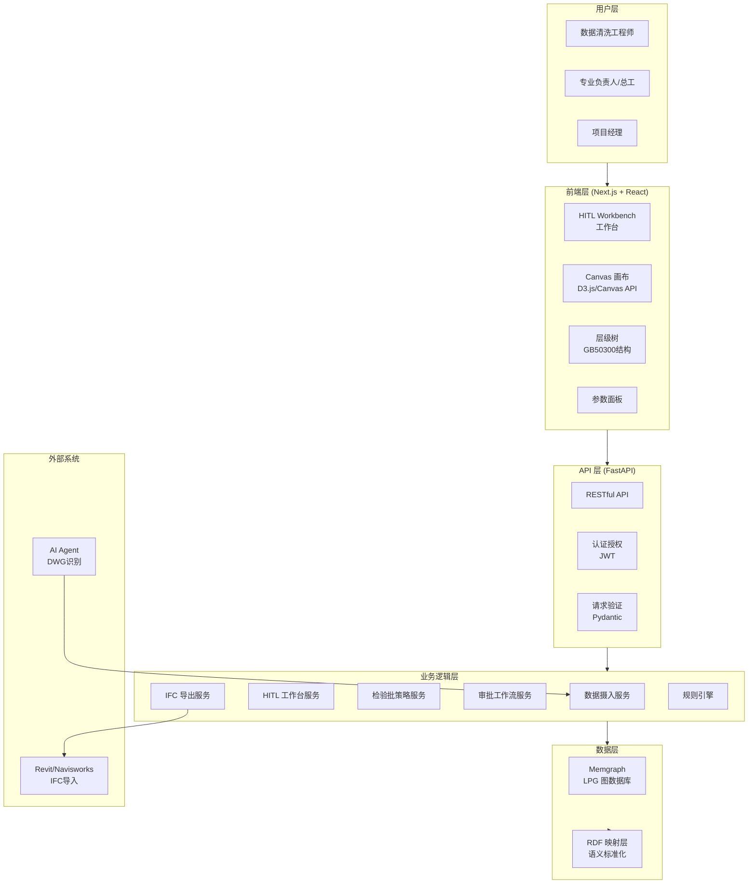

### 组件交互关系

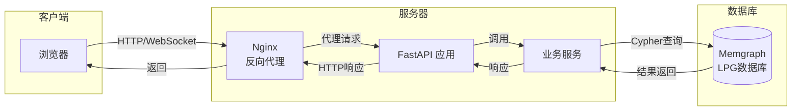

---

## Memgraph 数据模型图

### Graph-First 理念

OpenTruss 的核心是"Graph First"架构，所有数据以图的形式存储和查询：

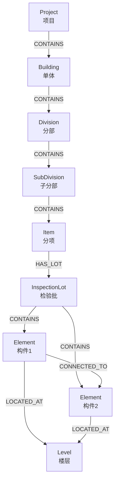

### 构件拓扑关系

在 Trace Mode 中，构件之间的拓扑连接关系：

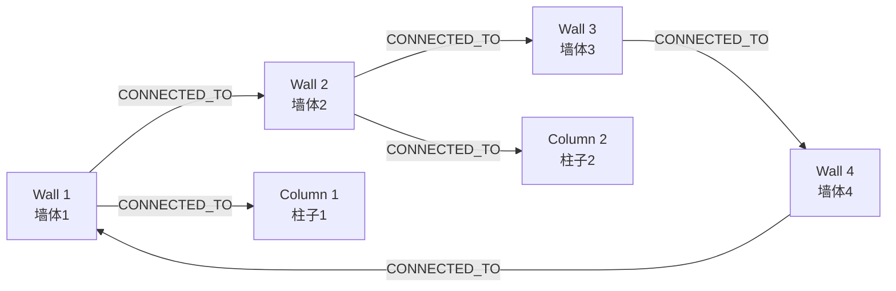

### 检验批层级结构示例

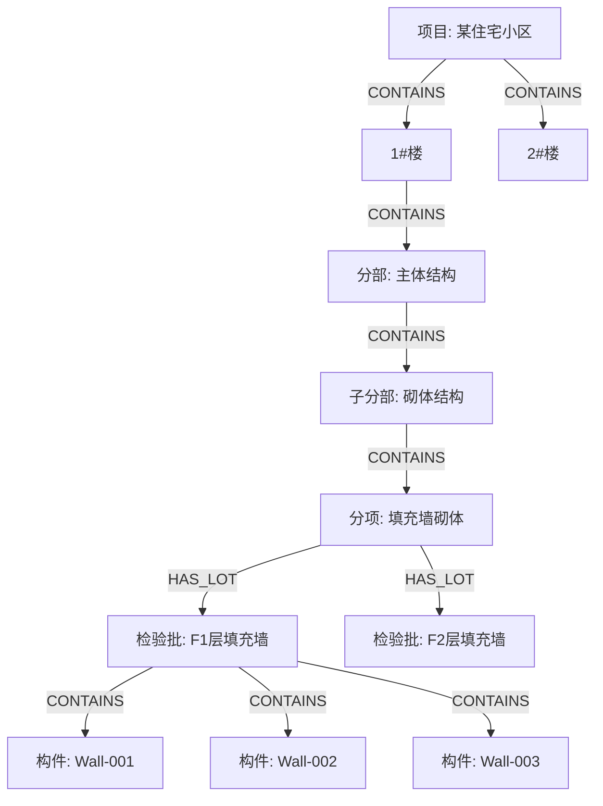

---

## 数据流转图

### 从 Speckle 到 IFC 的完整流程

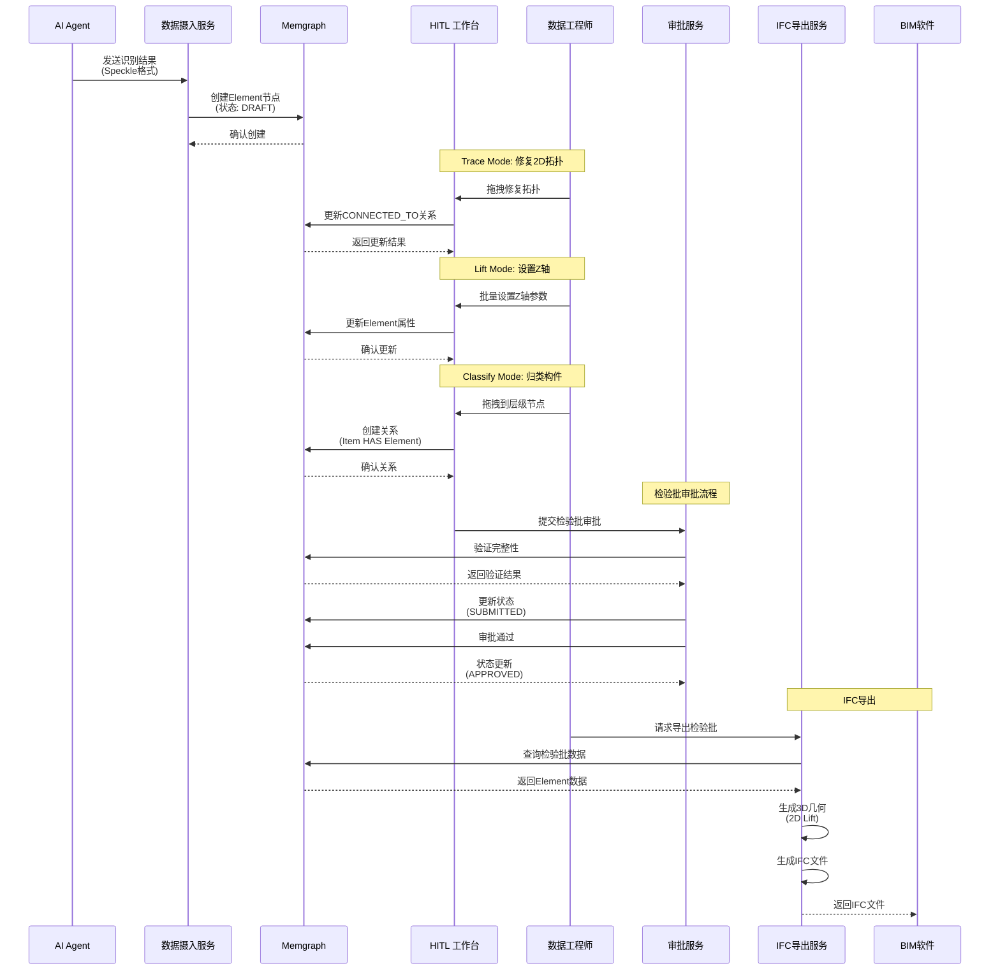

### 数据摄入流程（宽进严出）

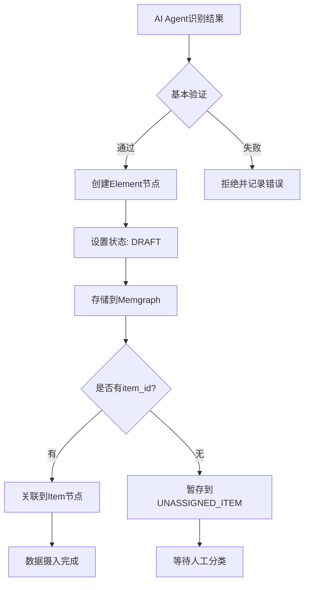

---

## HITL 工作流时序图

### Trace Mode: 拓扑修复流程

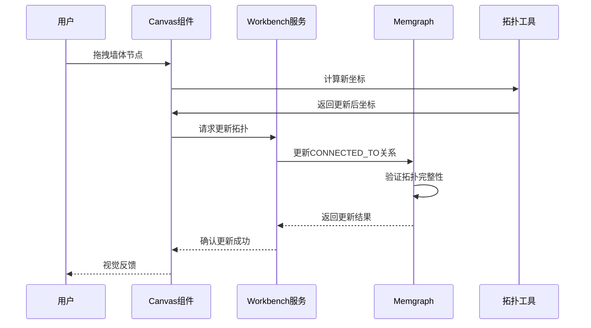

### Classify Mode: 构件归类流程

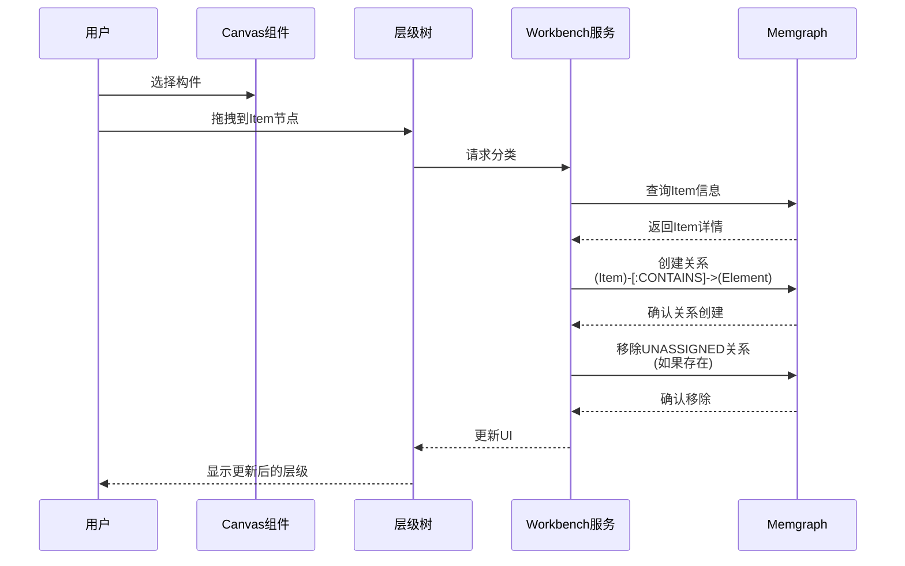

### 检验批审批流程

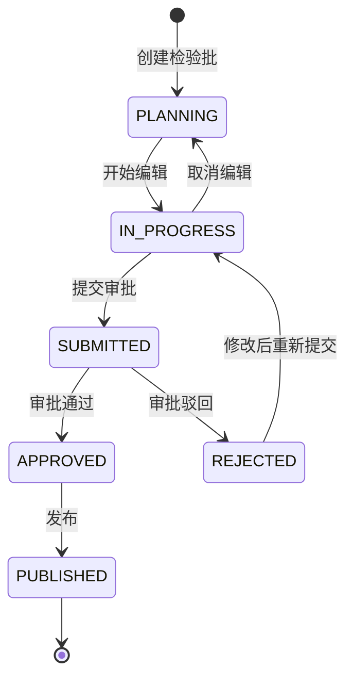

---

## 技术栈关系图

### 前端技术栈

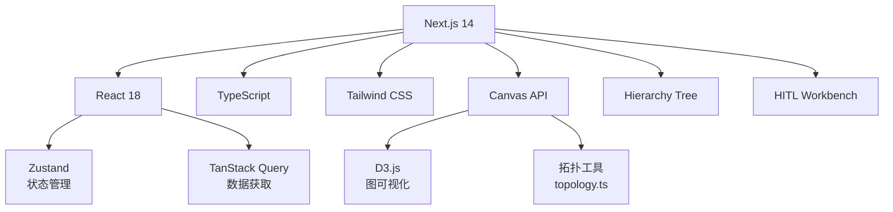

### 后端技术栈

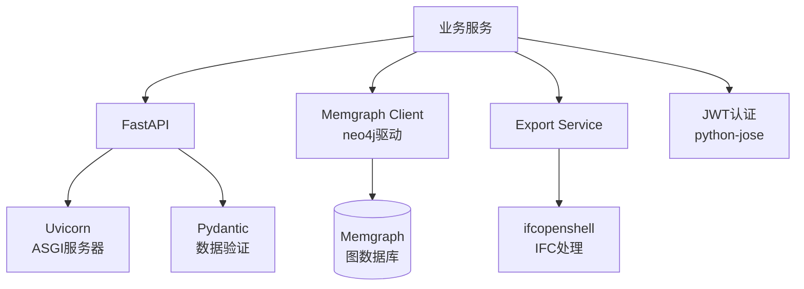

---

## 部署架构图

### Docker Compose 部署

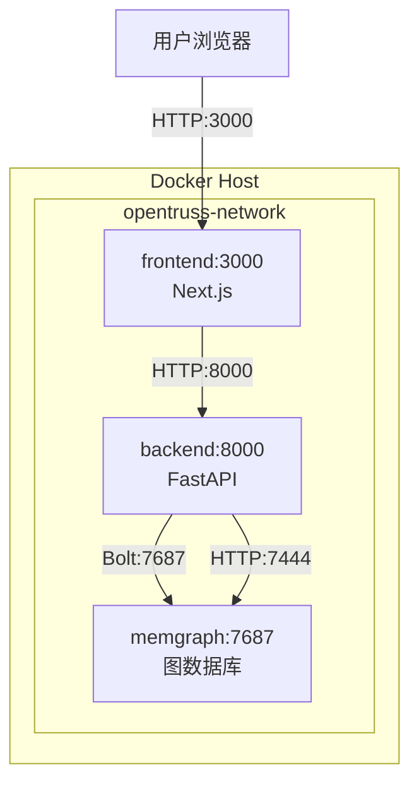

### 生产环境部署（建议）

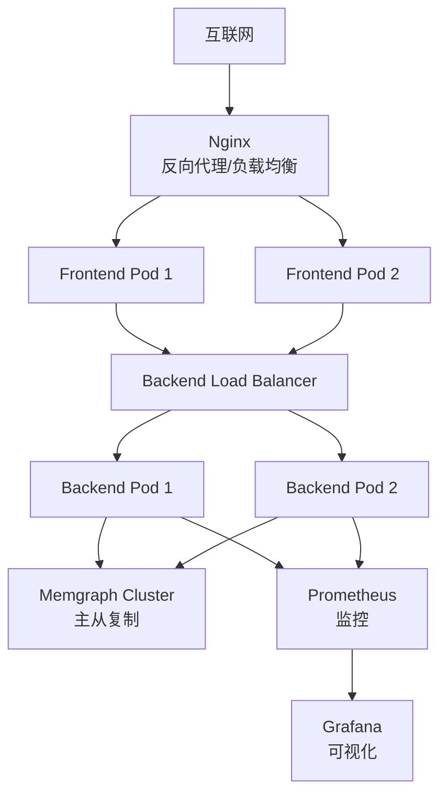

---

## 总结

OpenTruss 的架构设计遵循以下原则：

1. **Graph-First**: 所有数据以图的形式存储和查询，支持复杂的关系遍历
2. **分层清晰**: 前端、API、业务逻辑、数据层职责明确
3. **高性能**: Memgraph 提供毫秒级查询响应
4. **标准化**: RDF 映射确保语义一致性
5. **可扩展**: 支持水平扩展和集群部署

更多架构细节请参考 [ARCHITECTURE.md](../ARCHITECTURE.md)。

---

**最后更新**：2025-12-28  
**文档版本**：1.0  
**维护者**：OpenTruss 开发团队

