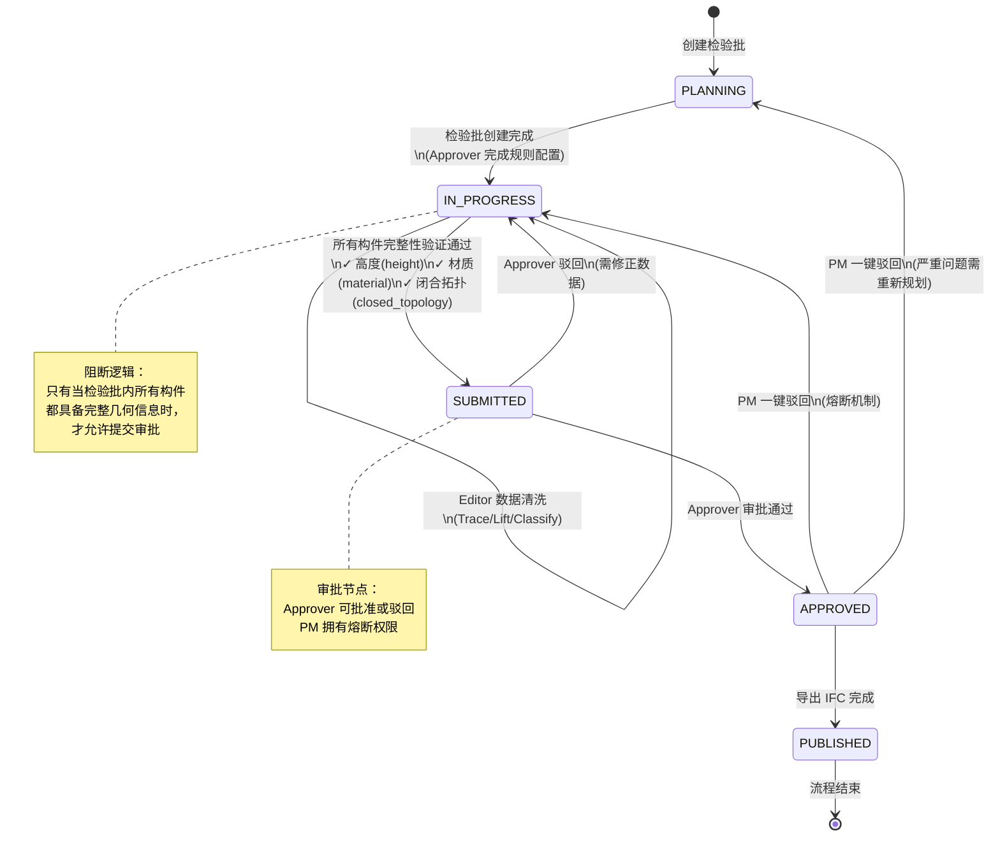
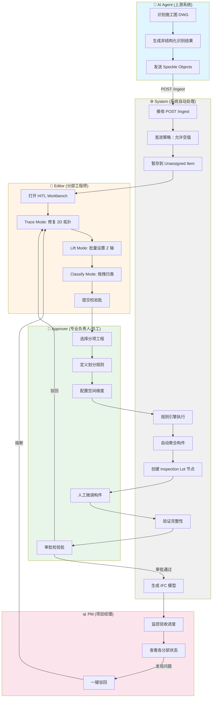
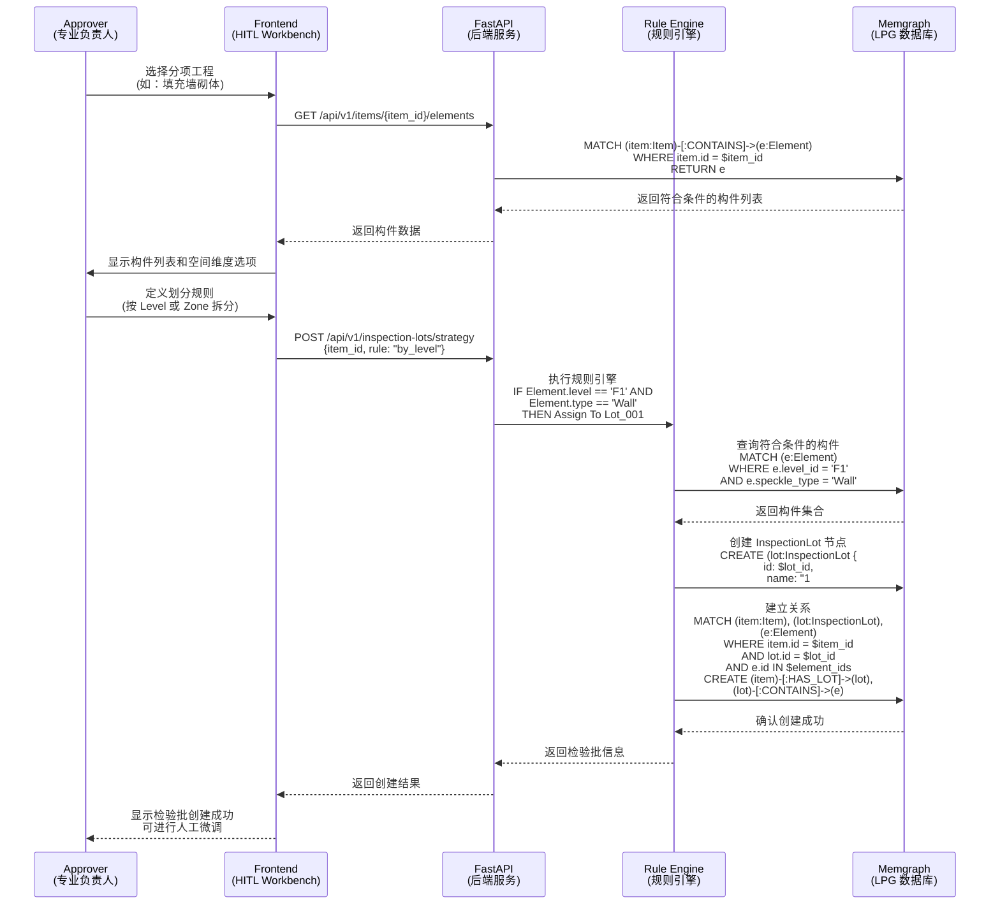
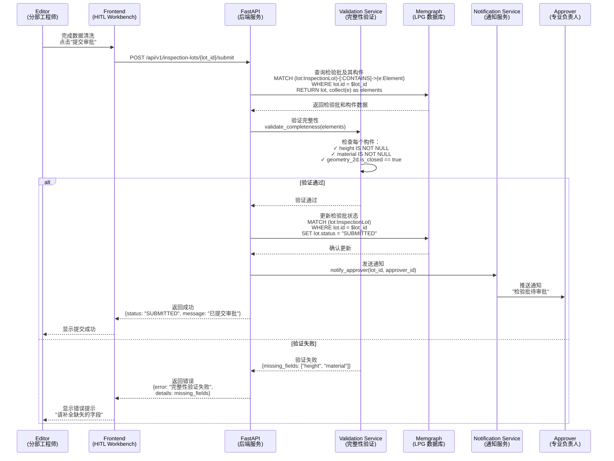
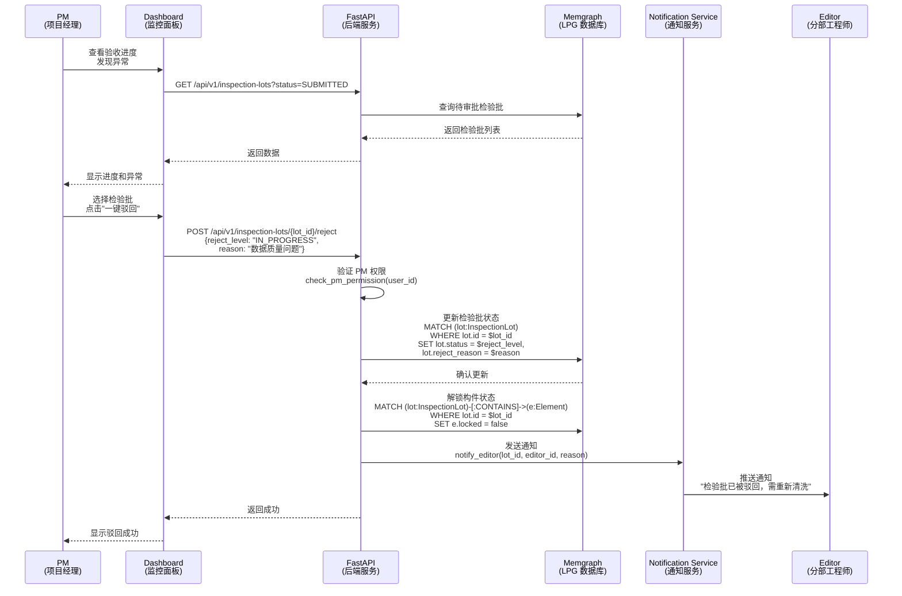

# OpenTruss 系统设计图表

本文档包含 OpenTruss 系统的核心设计图表，用于指导系统开发和团队协作。

---

## 1. 检验批状态机图 (Inspection Lot State Machine)

检验批是 OpenTruss 的核心验收单元，其状态流转遵循严格的工程管理规范。

### 状态说明

- **PLANNING（规划中）**：检验批已创建，但尚未开始数据清洗工作
- **IN_PROGRESS（清洗中）**：Editor 正在进行数据清洗、参数补全和拓扑修复
- **SUBMITTED（待审批）**：数据完整性验证通过，等待 Approver 审批
- **APPROVED（已验收）**：Approver 审批通过，检验批已验收
- **PUBLISHED（已发布）**：IFC 模型已成功导出，流程完成

### 关键转换条件

1. **PLANNING → IN_PROGRESS**：Approver 完成检验批规则配置，系统自动创建检验批节点
2. **IN_PROGRESS → SUBMITTED**：系统验证所有构件具备完整几何信息（高度、材质、闭合拓扑）
3. **SUBMITTED → APPROVED**：Approver 审批通过
4. **驳回路径**：
   - Approver 可驳回至 IN_PROGRESS（需修正数据）
   - PM 可一键驳回至 IN_PROGRESS 或 PLANNING（熔断机制）

---

## 2. 业务流程泳道图 (Business Process Swimlane)

展示从数据摄入到 IFC 导出的完整业务流程，涉及多个角色的协作。

### 流程阶段说明

1. **数据摄入阶段**：AI Agent 识别施工图并发送识别结果，系统采用"宽进严出"策略接收数据
2. **数据清洗阶段**：Editor 在 HITL Workbench 中进行 Trace、Lift、Classify 操作
3. **检验批策划阶段**：Approver 定义划分规则，系统自动聚合构件并创建检验批
4. **审批阶段**：Approver 审批检验批，PM 监控进度并拥有熔断权限
5. **导出阶段**：系统生成 IFC 模型，完成整个流程

---

## 3. 系统交互时序图 (System Interaction Sequence)

### 3.1 检验批创建流程

展示 Approver 创建检验批时，系统各组件之间的交互时序。

### 3.2 审批提交流程

展示 Editor 提交检验批审批时，系统验证和状态更新的完整流程。

### 3.3 PM 熔断流程

展示 PM 执行一键驳回操作时的系统交互。

---

## 图表使用说明

### 状态机图
- 用于理解检验批的完整生命周期
- 指导状态转换逻辑的实现
- 明确各角色的操作权限

### 泳道图
- 用于理解端到端的业务流程
- 明确各角色的职责边界
- 指导功能模块的划分

### 时序图
- 用于理解系统组件的交互细节
- 指导 API 设计和数据库操作
- 明确数据流转路径

---

## 技术实现要点

1. **状态机实现**：建议使用状态模式（State Pattern）或状态机库（如 Python 的 `transitions`）
2. **规则引擎**：建议使用可配置的规则引擎（如 `pyknow` 或自定义 DSL）
3. **验证服务**：建议将完整性验证逻辑独立为服务，便于测试和维护
4. **通知机制**：建议使用消息队列（如 RabbitMQ）实现异步通知

---

**最后更新**：2025-12-28  
**文档版本**：1.0  
**维护者**：OpenTruss 开发团队

